# Documentación de Ingeniería de Software y Carpeta de Proyecto (Stach)

Este documento contiene el análisis de cumplimiento de requisitos funcionales y no funcionales, la especificación técnica de los procesos de ciclo de vida, y todos los diagramas de ingeniería de software estructurados en orden cronológico por entregables (**T01-T08** y **G06-G07**), alineados estrictamente con el código de la solución.

---

## 1. Matriz de Cumplimiento de Requisitos

A continuación se detalla el análisis de conformidad de cada requisito con respecto a la implementación final en el código fuente de la solución:

| Código | Requisito | Estado | Ubicación en el Código C# | Evidencia Técnica / Observación |
| :--- | :--- | :--- | :--- | :--- |
| **RF-01** | Verificación de Integridad | **Cumplido** | [DigitoVerificadorService.cs](file:///c:/Users/lauti/source/repos/LautiSmyth/Stach/Servicios/DigitoVerificadorService.cs) (Línea 65) | Método `VerificarIntegridad()` que realiza el recálculo y comparación de DVH y DVV de la tabla `Usuario`. |
| **RF-02** | Detección de Corrupción | **Cumplido** | [DigitoVerificadorService.cs](file:///c:/Users/lauti/source/repos/LautiSmyth/Stach/Servicios/DigitoVerificadorService.cs) (Líneas 82-102) | Agrega detalles específicos a la lista de errores indicando ID, username, tipo de fallo (DVH / DVV) y campos afectados. |
| **RF-03** | Asistencia para Recuperación | **Cumplido** | [RestauracionForm.cs](file:///c:/Users/lauti/source/repos/LautiSmyth/Stach/GUI/RestauracionForm.cs) (Líneas 55-121) | El panel de emergencia brinda al administrador dos caminos claros de recuperación: **Recalcular Dígitos** o **Restaurar Backup**. |
| **RNF-01** | Acceso Restringido | **Cumplido** | [RestauracionForm.cs](file:///c:/Users/lauti/source/repos/LautiSmyth/Stach/GUI/RestauracionForm.cs) (Líneas 40, 57, 78) | Cada botón de recuperación exige autenticación mediante el modal [ConfirmarAdminForm.cs](file:///c:/Users/lauti/source/repos/LautiSmyth/Stach/GUI/ConfirmarAdminForm.cs). |
| **RF-04** | Validación Integridad Backup | **Cumplido** | [BackupService.cs](file:///c:/Users/lauti/source/repos/LautiSmyth/Stach/Servicios/BackupService.cs) (Líneas 26-31) | Lanza excepción y cancela el backup si `VerificarIntegridad()` retorna false, impidiendo respaldar datos inconsistentes. |
| **RF-05** | Restauración de Backups (Wizard) | **Cumplido** | [RestauracionWizardForm.cs](file:///c:/Users/lauti/source/repos/LautiSmyth/Stach/GUI/RestauracionWizardForm.cs) | Implementación paso a paso de un asistente de restauración con selección, desencriptación y advertencias. |
| **RF-06** | Backup Inicial | **Cumplido** | UI de Formularios | El backup puede crearse y guardarse indicando estado limpio y resguardo criptográfico. |
| **RF-08** | Recuperación con Pérdida Parcial | **Cumplido** | [RestauracionWizardForm.cs](file:///c:/Users/lauti/source/repos/LautiSmyth/Stach/GUI/RestauracionWizardForm.cs) | El asistente calcula y detalla dinámicamente la pérdida de cambios desde la fecha del backup. |
| **RNF-02** | Consistencia de Backups | **Cumplido** | [BackupService.cs](file:///c:/Users/lauti/source/repos/LautiSmyth/Stach/Servicios/BackupService.cs) (Línea 58) | Si el archivo `.stachbak` está alterado o la clave es incorrecta, se aborta la restauración lanzando una excepción cifrada. |
| **RF-09** | Mensajes de Login Seguros | **Cumplido** | [UsuarioBLL.cs](file:///c:/Users/lauti/source/repos/LautiSmyth/Stach/BLL/UsuarioBLL.cs) (Líneas 297-310) | Tanto para usuarios inexistentes como contraseñas incorrectas, se arroja el mensaje genérico `"Usuario o contraseña incorrectos."`. |
| **RF-10** | Protección de Usuarios Críticos | **Cumplido** | [UsuarioBLL.cs](file:///c:/Users/lauti/source/repos/LautiSmyth/Stach/BLL/UsuarioBLL.cs) y [PermisoBLL.cs](file:///c:/Users/lauti/source/repos/LautiSmyth/Stach/BLL/PermisoBLL.cs) | Validación estricta que impide desactivar, bloquear o degradar al último administrador activo del sistema global. |
| **RF-11** | Roles Jerárquicos (Composite) | **Cumplido** | `BE.ComponentePermiso`, `BE.Rol` | Patrón estructural Composite implementado correctamente. Las familias pueden contener sub-familias y patentes. |
| **RF-12** | Validación Dep. Circular | **Cumplido** | [PermisoBLL.cs](file:///c:/Users/lauti/source/repos/LautiSmyth/Stach/BLL/PermisoBLL.cs) (Línea 110) | Valida las relaciones circulares antes de persistir las asignaciones llamando al método `TieneDependenciaCircular`. |
| **RF-13** | Prevención Recursividad | **Cumplido** | [PermisoBLL.cs](file:///c:/Users/lauti/source/repos/LautiSmyth/Stach/BLL/PermisoBLL.cs) (Líneas 150-165) | El algoritmo recursivo usa un `HashSet<int>` de nodos visitados. Si detecta ciclo, interrumpe y lanza una excepción limpia. |
| **RNF-03** | Robustez de Perfiles | **Cumplido** | BLL / DAL | Soporta múltiples niveles de jerarquía resolviendo los permisos recursivamente en base de datos de manera óptima. |
| **RNF-04** | Manejo de Excepciones | **Cumplido** | [Program.cs](file:///c:/Users/lauti/source/repos/LautiSmyth/Stach/GUI/Program.cs) (Líneas 52-68) | Captura excepciones de hilos no controlados (`ThreadException` y `UnhandledException`), las loguea en bitácora y evita cierres abruptos. |
| **RF-14** | Historial de Entidades | **Cumplido** | [VersionUsuarioDAL.cs](file:///c:/Users/lauti/source/repos/LautiSmyth/Stach/DAL/VersionUsuarioDAL.cs) | Modificaciones a usuarios escriben automáticamente un registro histórico en la tabla `VersionUsuario`. |
| **RF-15** | Registro de Versiones | **Cumplido** | [UsuarioBLL.cs](file:///c:/Users/lauti/source/repos/LautiSmyth/Stach/BLL/UsuarioBLL.cs) (Líneas 150-160) | Genera versiones históricas detallando qué cambió, fecha y quién realizó la modificación. |
| **RF-16** | Rollback | **Cumplido** | [VersionUsuarioBLL.cs](file:///c:/Users/lauti/source/repos/LautiSmyth/Stach/BLL/VersionUsuarioBLL.cs) (Líneas 33-67) | Restaura los campos del usuario al estado de la versión elegida y recalcula sus dígitos verificadores automáticamente. |
| **RF-17** | Auditoría de Rollback | **Cumplido** | [VersionUsuarioBLL.cs](file:///c:/Users/lauti/source/repos/LautiSmyth/Stach/BLL/VersionUsuarioBLL.cs) (Línea 60) | Registra el evento de rollback en la bitácora con los detalles asociados a la versión recuperada. |
| **RF-18** | Trazabilidad Completa | **Cumplido** | `VersionUsuario` | Mantiene el historial íntegro de versiones anteriores. El rollback genera una versión de respaldo antes de aplicarse. |
| **RF-19** | Cambio Dinámico de Idioma | **Cumplido** | [ManejadorIdioma.cs](file:///c:/Users/lauti/source/repos/LautiSmyth/Stach/Servicios/ManejadorIdioma.cs) | Permite actualizar leyendas dinámicamente llamando al método `CambiarIdioma` en tiempo de ejecución. |
| **RF-20** | Actualización por Observer | **Cumplido** | `BE.IObserver`, `BE.ISubject` | Implementa el patrón Observer. Los formularios se registran en `ManejadorIdioma` y actualizan sus controles al recibir notificación. |
| **RF-21** | Identificadores de Traducción | **Cumplido** | [IdiomaForm.cs](file:///c:/Users/lauti/source/repos/LautiSmyth/Stach/GUI/IdiomaForm.cs) (Líneas 276-295) | Asocia las leyendas de formularios mediante claves de strings leyibles (ej: `UsuariosForm.btnGuardar`). |
| **RF-22** | Idioma por Usuario | **Cumplido** | [UsuarioBLL.cs](file:///c:/Users/lauti/source/repos/LautiSmyth/Stach/BLL/UsuarioBLL.cs) (Líneas 327-343) | Al loguearse un usuario, el sistema lee su preferencia de idioma y cambia la UI automáticamente. |
| **RF-23** | Persistencia de Idioma | **Cumplido** | [UsuarioDAL.cs](file:///c:/Users/lauti/source/repos/LautiSmyth/Stach/DAL/UsuarioDAL.cs) | Guarda y recupera la relación del usuario con su idioma de preferencia (`IdIdioma`) en la base de datos. |
| **RF-24** | Idioma en Pantalla de Login | **Cumplido** | [LoginForm.cs](file:///c:/Users/lauti/source/repos/LautiSmyth/Stach/GUI/LoginForm.cs) (Líneas 161-168) | La pantalla de login incluye un selector de idioma que permite cambiar el idioma antes de autenticarse. |
| **RNF-05** | Independencia de Idioma | **Cumplido** | [SessionManager.cs](file:///c:/Users/lauti/source/repos/LautiSmyth/Stach/Servicios/SessionManager.cs) | Al ser una aplicación WinForms desktop, cada proceso en ejecución corre de forma independiente y mantiene su propia sesión de idioma. |

---

## 2. Especificación de Procesos del Ciclo de Vida del Sistema

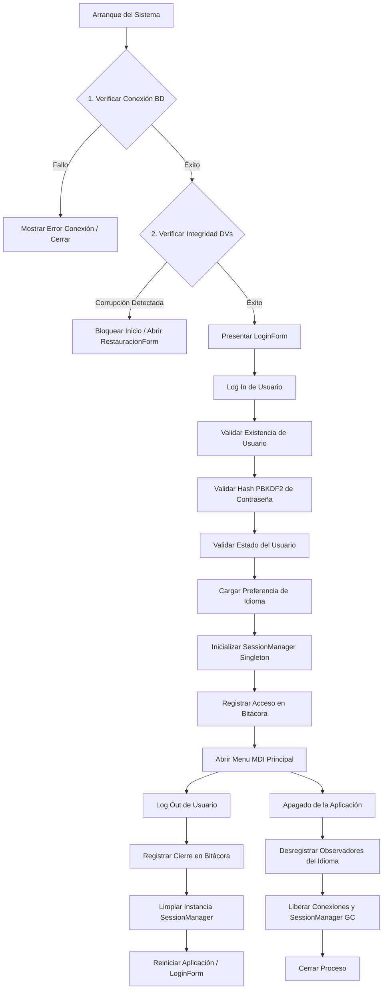

### A. Arranque del Sistema (Startup)
*   **Conectividad**: Se resuelve `IConexionService` para verificar la base de datos. Si no hay conexión, se alerta al usuario y finaliza la aplicación (`Application.Exit()`).
*   **Integridad**: Si hay conexión, se invoca `IDigitoVerificadorService.VerificarIntegridad()`. Si la base de datos está alterada (fallo de DVH o DVV), se abre obligatoriamente `RestauracionForm` en modo de contingencia, exigiendo credenciales administrativas o la clave maestra de recuperación (DPAPI) para poder ingresar y asistir la recuperación.

### B. Inicio de Sesión (Log In)
*   **Seguridad**: Se busca el usuario en la BD de forma segura mediante parámetros SQL. Si existe, se computa y compara el hash PBKDF2. Si falla en cualquier punto, se muestra un mensaje genérico y se incrementan intentos fallidos (bloqueando la cuenta temporalmente si llega a 3).
*   **Sesión y Entorno**: Si la validación es correcta, se instancia la sesión única en el `SessionManager` (Singleton), se cargan las familias y patentes recursivamente mediante el Composite, se cambia el idioma del sistema al seleccionado por el usuario y se escribe el evento exitoso en la Bitácora. Finalmente, se abre el formulario principal MDI `MenuForm`.

### C. Cierre de Sesión (Log Out)
*   **Auditoría**: Se obtiene el usuario activo en sesión y se genera el registro del cierre de sesión en la Bitácora.
*   **Limpieza**: Se llama al método `Logout()` de `SessionManager`, destruyendo la referencia del usuario en memoria para evitar accesos remanentes.
*   **Reinicio**: Se destruye el formulario principal MDI y se ejecuta `Application.Restart()` para presentar de nuevo el `LoginForm` de manera limpia.

### D. Apagado (Shutdown)
*   **Desacoplamiento**: Se llama al método `Detach(this)` en el `ManejadorIdioma` para todos los formularios abiertos, eliminándolos de la lista de observadores activos del patrón Observer y evitando fugas de memoria (*memory leaks*).
*   **Cierre de Recursos**: Se liberan hilos de ejecución activos, se asegura el cierre de cualquier conexión huérfana de ADO.NET y el proceso del sistema operativo es finalizado.

---

## 3. Diagramas Técnicos de la Solución (Ordenados por Entregable)

A continuación se presentan los diagramas de ingeniería de software detallados por cada entregable de la carpeta de proyecto.

---

### T01. Arquitectura Base

#### Diagrama de Componentes (Mermaid)
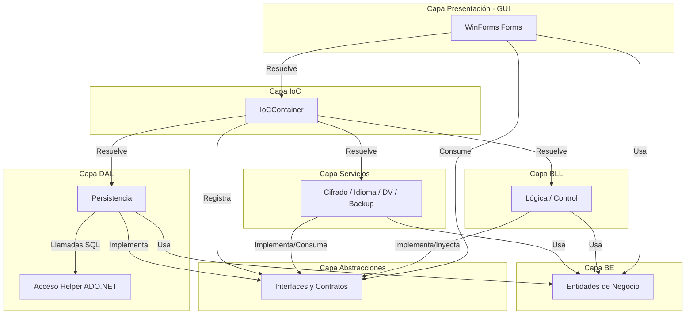

#### Diagrama de Componentes (PlantUML)
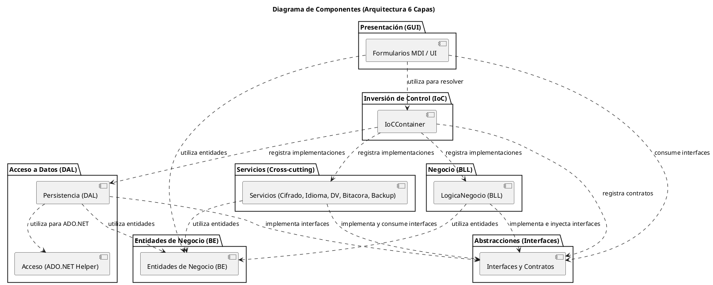

#### Diagrama de Secuencia – Persistencia (Genérico - Con Interfaz y Clase DAL)
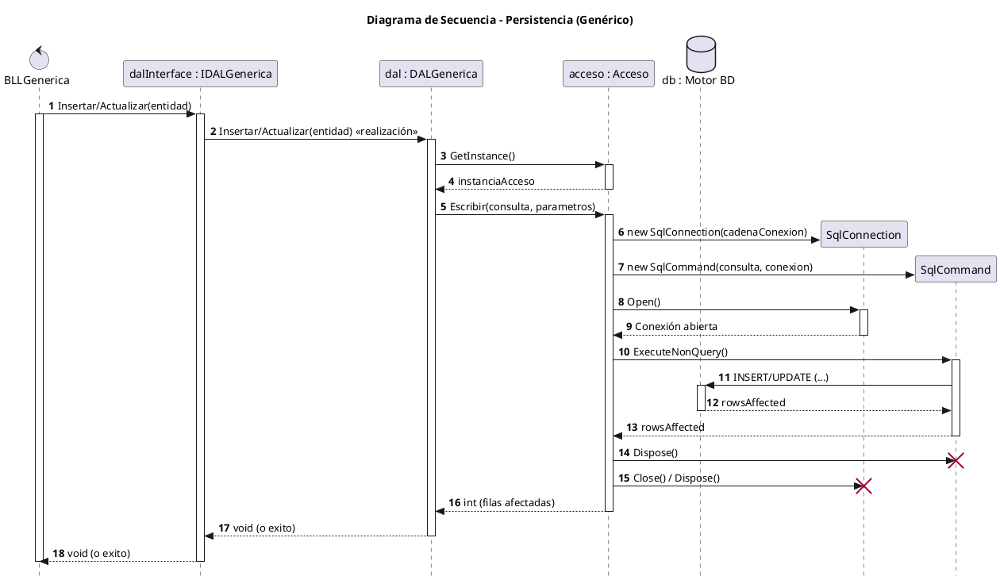

#### Diagrama de Secuencia – Consulta (Genérico - Con Interfaz y Clase DAL)
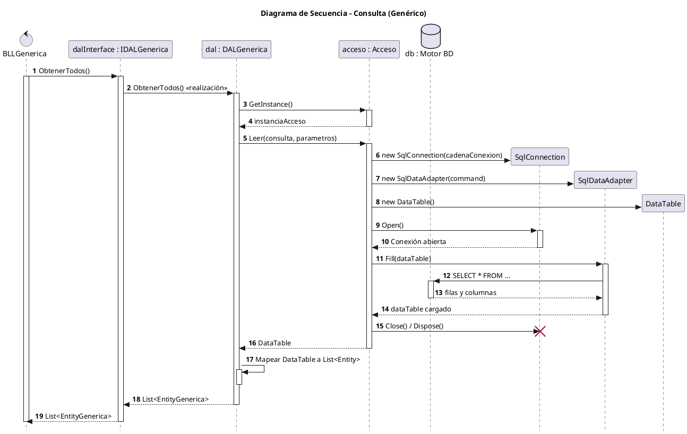

#### Mapa de Navegación del Sistema (MDI)
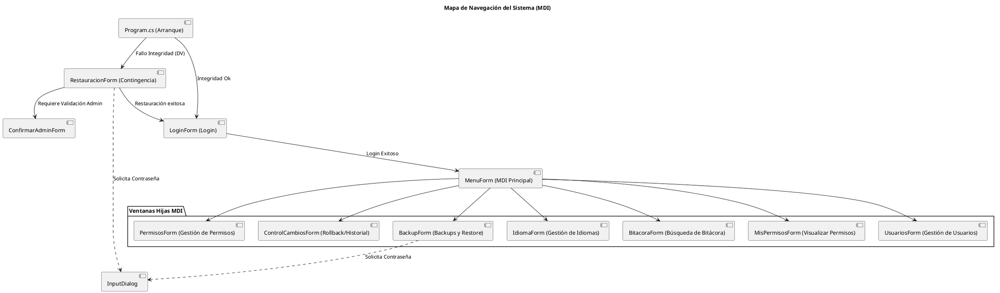

---

### T02. Gestión de Log In / Log Out y Gestión de Usuarios

#### Diagrama de Casos de Uso – Login / Logout
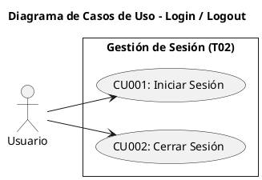

#### Diagrama de Clases – Login / Logout (Con Multiplicidades)
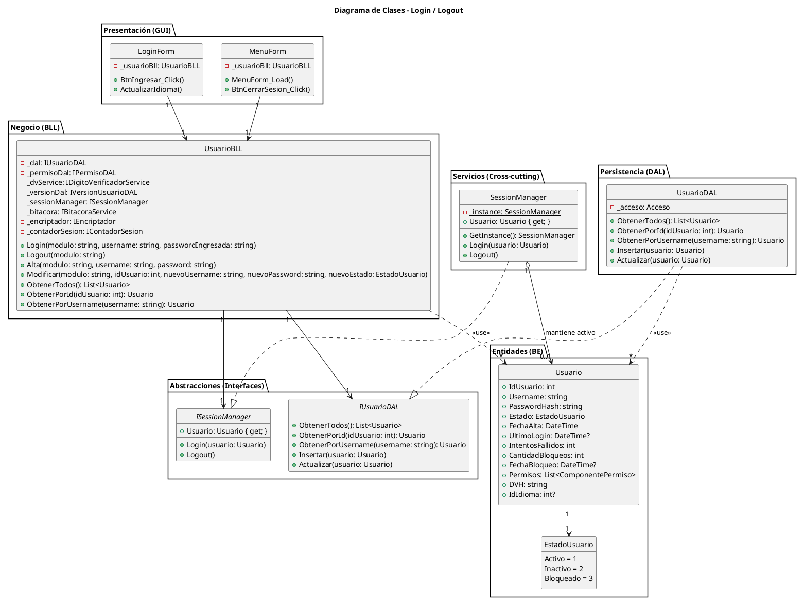

#### Diagrama de Entidad Relación (Pata de Gallo) – Login / Logout (Con Cardinalidad Crow's Foot)
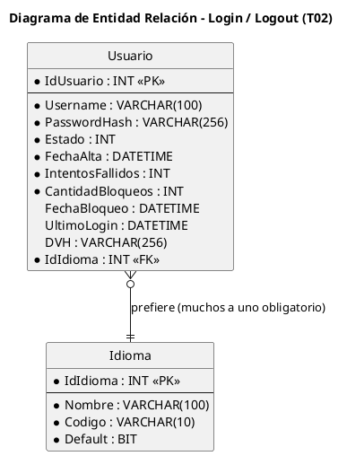

#### Diagrama de Secuencia – Verificación de Usuario al Ingresar Sesión (Login - Enfoque Duradero de Interfaces)
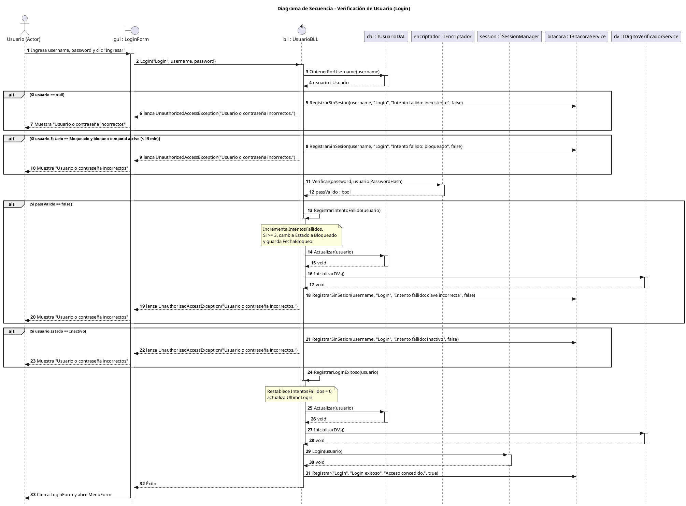

#### Diagrama de Secuencia – Cierre de Sesión (Logout - Enfoque Duradero de Interfaces)
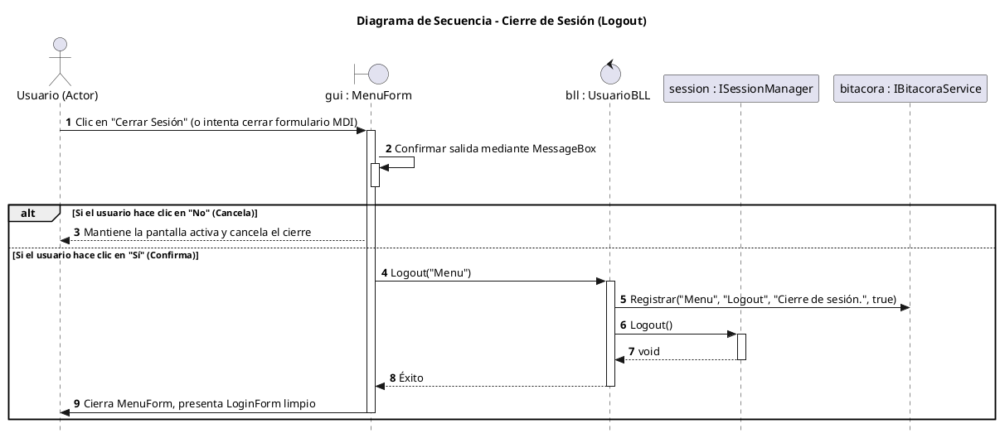

---

### T03. Gestión de Encriptado

#### Diagrama de Clases – Encriptador
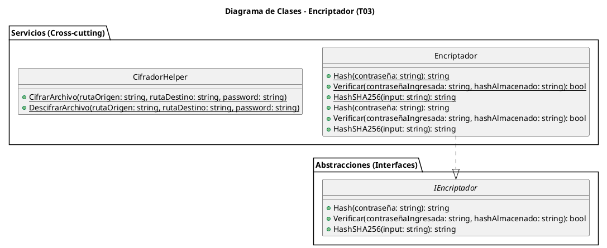

---

### T04. Gestión de Perfiles de Usuario (Composite)

#### Diagrama de Clases – Perfiles (Composite con Multiplicidades)
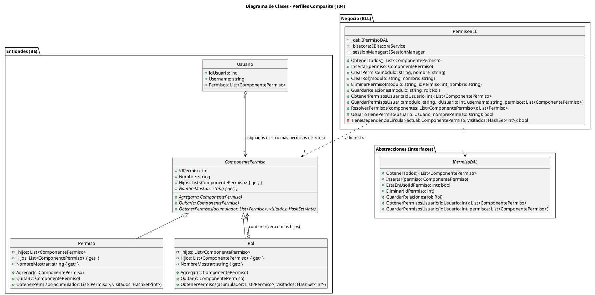

#### Diagrama de Entidad Relación (Pata de Gallo) – Perfiles (Con Cardinalidad Crow's Foot)
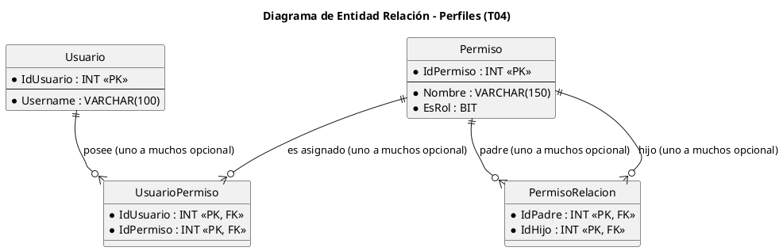

#### Diagrama de Secuencia – Resolución Recursiva de Permisos (Composite)
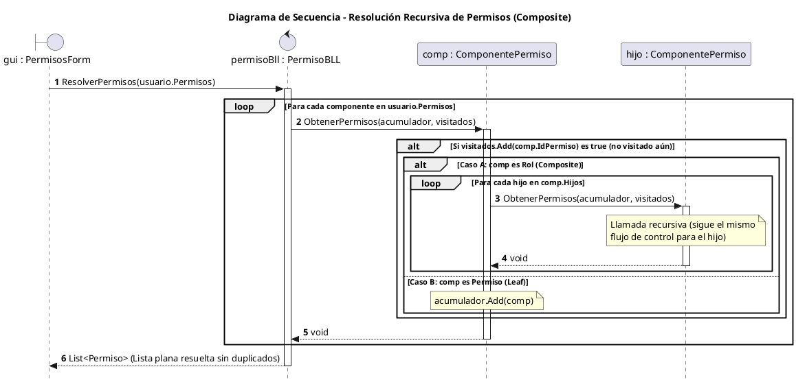


---

### T05. Gestión de Múltiples Idiomas (Observer)

#### Diagrama de Clases – Idiomas (Observer con Multiplicidades)
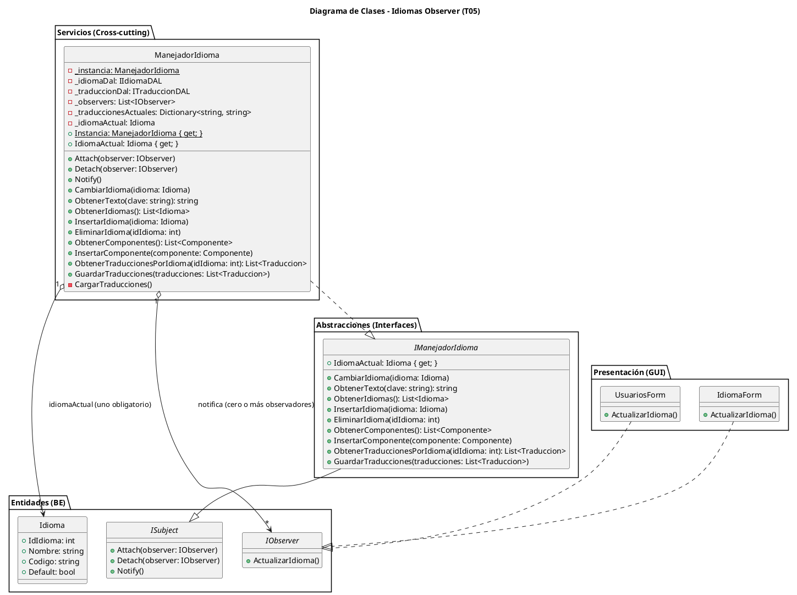

#### Diagrama de Entidad Relación (Pata de Gallo) – Idiomas (Con Cardinalidad Crow's Foot)
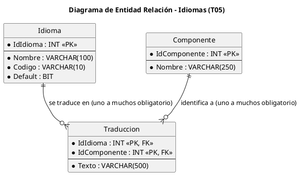

#### Diagrama de Secuencia – Cambio Dinámico de Idioma (Observer)
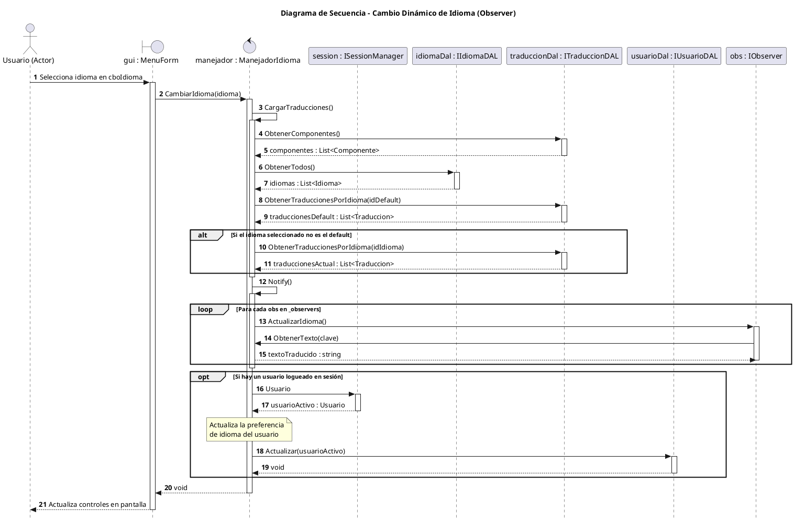


---

### T06. Gestión de Bitácora y Control de Cambios

#### T06a. Gestión de Bitácora

##### Diagrama de Casos de Uso – Bitácora
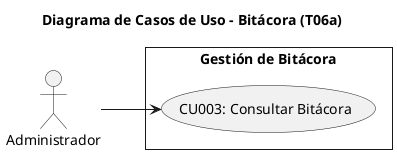

##### Diagrama de Clases – Bitácora (Con Multiplicidades)
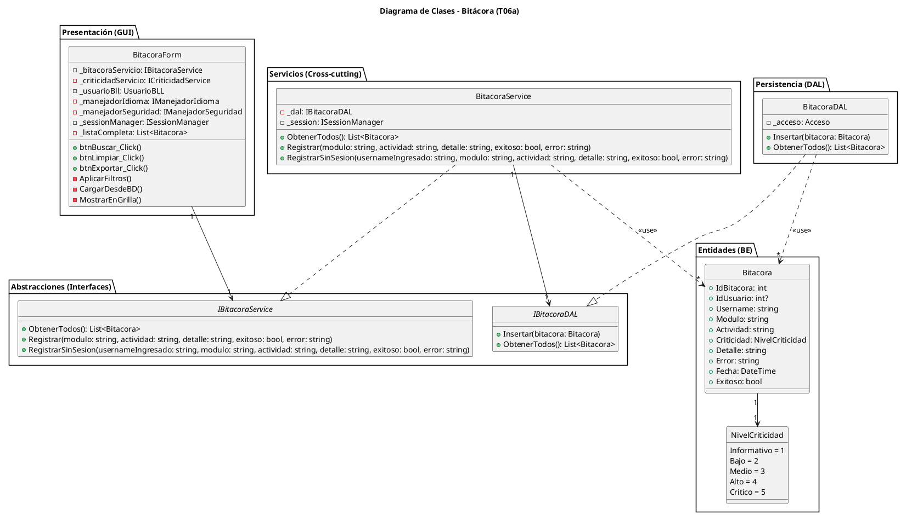

##### Diagrama de Entidad Relación (Pata de Gallo) – Bitácora
```plantuml
@startuml
skinparam style strictuml
title Diagrama de Entidad Relación - Bitácora (T06a)

entity "Bitacora" as B {
  * IdBitacora : INT <<PK>>
  --
  * Fecha : DATETIME
  IdUsuario : INT <<FK>>
  Username : VARCHAR(100)
  * Modulo : VARCHAR(100)
  * Actividad : VARCHAR(100)
  * IdCriticidad : INT <<FK>>
  * Detalle : VARCHAR(500)
  Error : VARCHAR(MAX)
  * Exitoso : BIT
}

entity "Criticidad" as C {
  * IdCriticidad : INT <<PK>>
  --
  * Nombre : VARCHAR(50)
  * ColorHex : VARCHAR(7)
  * Orden : INT
}

B }o--|| C : "criticidad de (muchos a uno obligatorio)"
@endum
```

##### Diagrama de Secuencia – Ver y Filtrar Bitácora (Filtrado en Memoria - Enfoque Duradero de Interfaces)
```plantuml
@startuml
autonumber
skinparam style strictuml
title Diagrama de Secuencia - Ver y Filtrar Bitácora

actor "Administrador (Actor)" as A
boundary "gui : BitacoraForm" as GUI
participant "bitacoraService : IBitacoraService" as BLL
participant "dal : IBitacoraDAL" as DAL

A -> GUI: Abre formulario Bitácora
activate GUI

GUI -> BLL: ObtenerTodos()
activate BLL
BLL -> DAL: ObtenerTodos()
activate DAL
DAL --> BLL: listaBitacora : List<Bitacora>
deactivate DAL
BLL --> GUI: listaBitacora : List<Bitacora>
deactivate BLL

GUI -> GUI: Guarda lista completa en memoria (_listaLocal)

A -> GUI: Modifica controles de filtro (ej: escribe Username, tilda checkboxes)
GUI -> GUI: FiltrarGrilla()
note over GUI: Recorre _listaLocal en memoria aplicando los filtros\nsin realizar llamadas a base de datos ni a BLL.

GUI --> A: Actualiza DataGridView con la lista filtrada
deactivate GUI
@endum
```

##### Diagrama de Secuencia – Registro en Bitácora (Genérico/Transversal - Enfoque Duradero de Interfaces)
```plantuml
@startuml
autonumber
skinparam style strictuml
title Diagrama de Secuencia - Registro Transversal en Bitácora

control "bll : BLLGenerica" as BLL
participant "bitacora : IBitacoraService" as Bit
participant "session : ISessionManager" as Session
participant "mapper : CriticidadMapper" as Map
participant "dal : IBitacoraDAL" as DAL

BLL -> Bit: Registrar(modulo, actividad, detalle, exitoso)
activate Bit

Bit -> Session: Usuario
activate Session
Session --> Bit: usuarioActivo : Usuario
deactivate Session

Bit -> Map: Obtener(actividad)
activate Map
note over Map: Traduce la actividad al NivelCriticidad correspondiente
Map --> Bit: criticidad : NivelCriticidad
deactivate Map

Bit -> DAL: Insertar(entidadBitacora)
activate DAL
DAL --> Bit: void
deactivate DAL

Bit --> BLL: void
deactivate Bit
@endum
```

---

#### T06b. Control de Cambios (Historial de Entidades)

##### Diagrama de Clases – Control de Cambios (Con Multiplicidades)
```plantuml
@startuml
skinparam style strictuml
title Diagrama de Clases - Control de Cambios (T06b)

package "Presentación (GUI)" {
    class ControlCambiosForm {
        - _usuarioBll: UsuarioBLL
        - _versionBll: VersionUsuarioBLL
        - _manejadorIdioma: IManejadorIdioma
        - _manejadorSeguridad: IManejadorSeguridad
        - _sessionManager: ISessionManager
        - _versiones: List<VersionUsuario>
        - _seleccionado: VersionUsuario
        + btnRollback_Click()
        + dgvVersiones_SelectionChanged()
        + cboUsuarios_SelectedIndexChanged()
        - CargarUsuarios()
        - CargarVersiones()
        - ActualizarIdioma()
    }
}

package "Negocio (BLL)" {
    class VersionUsuarioBLL {
        - _dal: IVersionUsuarioDAL
        - _usuarioDal: IUsuarioDAL
        - _dvService: IDigitoVerificadorService
        - _bitacora: IBitacoraService
        + Insertar(version: VersionUsuario)
        + ObtenerPorUsuario(idUsuario: int): List<VersionUsuario>
        + RestaurarVersion(modulo: string, idVersion: int, actor: string)
    }
}

package "Abstracciones (Interfaces)" {
    interface IVersionUsuarioDAL {
        + Insertar(version: VersionUsuario)
        + ObtenerPorUsuario(idUsuario: int): List<VersionUsuario>
        + ObtenerPorId(idVersion: int): VersionUsuario
    }
}

package "Persistencia (DAL)" {
    class VersionUsuarioDAL {
        - _acceso: Acceso
        + Insertar(version: VersionUsuario)
        + ObtenerPorUsuario(idUsuario: int): List<VersionUsuario>
        + ObtenerPorId(idVersion: int): VersionUsuario
    }
}

package "Entidades (BE)" {
    class VersionUsuario {
        + IdVersion: int
        + IdUsuario: int
        + Username: string
        + PasswordHash: string
        + Estado: EstadoUsuario
        + ModificadoPor: string
        + FechaModificacion: DateTime
        + DetalleCambios: string
    }
}

ControlCambiosForm "1" --> "1" VersionUsuarioBLL
ControlCambiosForm "1" --> "1" UsuarioBLL
VersionUsuarioBLL "1" --> "1" IVersionUsuarioDAL
VersionUsuarioBLL "1" --> "1" IUsuarioDAL
VersionUsuarioDAL ..|> IVersionUsuarioDAL
VersionUsuarioDAL ..> "*" VersionUsuario : <<use>>
VersionUsuarioBLL ..> "*" VersionUsuario : <<use>>
@endum
```

##### Diagrama de Entidad Relación (Pata de Gallo) – Control de Cambios (Con Cardinalidad Crow's Foot)
```plantuml
@startuml
skinparam style strictuml
title Diagrama de Entidad Relación - Control de Cambios (T06b)

entity "Usuario" as U {
  * IdUsuario : INT <<PK>>
  --
  * Username : VARCHAR(100)
  * PasswordHash : VARCHAR(200)
  * Estado : INT
}

entity "HistorialUsuario" as HU {
  * IdVersion : INT <<PK>>
  --
  * IdUsuario : INT <<FK>>
  * Username : VARCHAR(100)
  * PasswordHash : VARCHAR(200)
  * Estado : INT
  * Actor : VARCHAR(100)
  * Fecha : DATETIME
  * Detalle : VARCHAR(500)
}

U ||--o{ HU : "genera historial de (uno a muchos opcional)"
@endum
```

##### Diagrama de Secuencia – Recomponer Versión (Rollback - Enfoque Duradero de Interfaces)
```plantuml
@startuml
autonumber
skinparam style strictuml
title Diagrama de Secuencia - Recomponer Versión (Rollback)

actor "Administrador (Actor)" as A
boundary "gui : ControlCambiosForm" as GUI
control "versionBll : VersionUsuarioBLL" as VBLL
participant "dalVersion : IVersionUsuarioDAL" as VDAL
participant "dalUsuario : IUsuarioDAL" as UDAL
participant "dvService : IDigitoVerificadorService" as DV
participant "bitacora : IBitacoraService" as Bit

A -> GUI: Selecciona versión y hace clic en "Recomponer"
activate GUI

GUI -> VBLL: Recomponer(idVersion)
activate VBLL

VBLL -> VDAL: ObtenerPorId(idVersion)
activate VDAL
VDAL --> VBLL: version : VersionUsuario
deactivate VDAL

VBLL -> UDAL: ObtenerPorId(version.IdUsuario)
activate UDAL
UDAL --> VBLL: usuarioActual : Usuario
deactivate UDAL

note over VBLL: Genera versión de respaldo actual\nantes de aplicar la vieja versión
VBLL -> VDAL: Insertar(respaldoUsuarioActual)
activate VDAL
VDAL --> VBLL: void
deactivate VDAL

note over VBLL: Restaura campos del usuario\ncon los de la versión seleccionada
VBLL -> DV: RecalcularDigitos(usuarioActual)
activate DV
DV --> VBLL: void
deactivate DV

VBLL -> UDAL: Actualizar(usuarioActual)
activate UDAL
UDAL --> VBLL: void
deactivate UDAL

VBLL -> Bit: Registrar("ControlCambios", "Rollback", "Recomposición de usuario exitosa.", true)
activate Bit
Bit --> VBLL: void
deactivate Bit

VBLL --> GUI: Éxito
deactivate VBLL

GUI --> A: Muestra "Recomposición aplicada correctamente"
deactivate GUI
@endum
```

---

### T07. Gestión de Backup (Wizard)

#### Diagrama de Clases – Backup (Con Multiplicidades)
```plantuml
@startuml
skinparam style strictuml
title Diagrama de Clases - Backup / Restore Wizard (T07)

package "Presentación (GUI)" {
    class BackupForm {
        - _backupService: IBackupService
        - _manejadorIdioma: IManejadorIdioma
        - _manejadorSeguridad: IManejadorSeguridad
        - _sessionManager: ISessionManager
        - _usuarioBll: UsuarioBLL
        + btnCrear_Click()
        + btnRestaurar_Click()
        + ActualizarIdioma()
    }
    class RestauracionWizardForm {
        - _backupService: IBackupService
        - _manejadorIdioma: IManejadorIdioma
        - _currentStep: int
        - _rutaArchivo: string
        - _password: string
        + RestauradoExitosamente: bool { get; }
        + BtnNext_Click()
        - ProcesarPaso1()
        - ProcesarPaso2()
        - ObtenerFechaDeBackup(rutaArchivo: string): DateTime
        - CargarPaso(paso: int)
        - btnBrowse_Click()
    }
}

package "Abstracciones (Interfaces)" {
    interface IBackupService {
        + RealizarBackup(modulo: string, rutaArchivo: string, claveCifrado: string)
        + RestaurarBackup(modulo: string, rutaArchivo: string, claveCifrado: string)
        + ObtenerCantRegistrosBitacoraNuevos(fecha: DateTime): int
        + ObtenerCantRegistrosCambiosNuevos(fecha: DateTime): int
    }
    interface IBackupDAL {
        + RealizarBackup(rutaDestino: string)
        + RestaurarBackup(rutaOrigen: string)
        + ObtenerCantRegistrosBitacoraNuevos(fecha: DateTime): int
        + ObtenerCantRegistrosCambiosNuevos(fecha: DateTime): int
    }
}

package "Servicios (Cross-cutting)" {
    class BackupService {
        - _dal: IBackupDAL
        - _bitacora: IBitacoraService
        - _session: ISessionManager
        - _dvService: IDigitoVerificadorService
        + RealizarBackup(modulo: string, rutaArchivo: string, claveCifrado: string)
        + RestaurarBackup(modulo: string, rutaArchivo: string, claveCifrado: string)
        + ObtenerCantRegistrosBitacoraNuevos(fecha: DateTime): int
        + ObtenerCantRegistrosCambiosNuevos(fecha: DateTime): int
    }
}

package "Persistencia (DAL)" {
    class BackupDAL {
        - _acceso: Acceso
        + RealizarBackup(rutaDestino: string)
        + RestaurarBackup(rutaOrigen: string)
        + ObtenerCantRegistrosBitacoraNuevos(fecha: DateTime): int
        + ObtenerCantRegistrosCambiosNuevos(fecha: DateTime): int
    }
}

BackupForm "1" ..> "1" RestauracionWizardForm : abre (instancia modal)
RestauracionWizardForm "1" --> "1" IBackupService
BackupService ..|> IBackupService
BackupService "1" --> "1" IBackupDAL
BackupDAL ..|> IBackupDAL
@endum
```

#### Diagrama de Secuencia – Restauración de Backup con Wizard (Enfoque Duradero de Interfaces)
```plantuml
@startuml
autonumber
skinparam style strictuml
title Diagrama de Secuencia - Restauración con Asistente (Wizard)

actor "Administrador (Actor)" as A
boundary "gui : RestauracionWizardForm" as Wizard
participant "backupService : IBackupService" as SRV
participant "cifrador : CifradorHelper" as Cifr
participant "dal : IBackupDAL" as DAL
participant "dv : IDigitoVerificadorService" as DV
participant "bitacora : IBitacoraService" as Bit

A -> Wizard: Clic en "Restaurar Backup" (Inicia Wizard)
activate Wizard

note over Wizard: Paso 1: Selección de Archivo y Contraseña
A -> Wizard: Selecciona archivo y escribe clave
A -> Wizard: Clic en "Siguiente"
Wizard -> Wizard: ProcesarPaso1()

Wizard -> Wizard: ObtenerFechaDeBackup(rutaArchivo)

Wizard -> SRV: ObtenerCantRegistrosBitacoraNuevos(fechaBackup)
activate SRV
SRV -> DAL: ObtenerCantRegistrosBitacoraNuevos(fechaBackup)
activate DAL
DAL --> SRV: logsPerdidos : int
deactivate DAL
SRV --> Wizard: logsPerdidos : int
deactivate SRV

Wizard -> SRV: ObtenerCantRegistrosCambiosNuevos(fechaBackup)
activate SRV
SRV -> DAL: ObtenerCantRegistrosCambiosNuevos(fechaBackup)
activate DAL
DAL --> SRV: cambiosPerdidos : int
deactivate DAL
SRV --> Wizard: cambiosPerdidos : int
deactivate SRV

Wizard --> A: Presenta panel Paso 2 con detalle de registros a perder

note over Wizard: Paso 2: Análisis y Confirmación de Pérdida
A -> Wizard: Clic en "Restaurar"
Wizard -> Wizard: ProcesarPaso2()
Wizard -> Wizard: Muestra diálogo de confirmación final
A -> Wizard: Confirma haciendo clic en "Sí"

Wizard -> SRV: RestaurarBackup("RestauracionWizard", rutaArchivo, password)
activate SRV

SRV -> Cifr: DescifrarArchivo(rutaArchivo, tempPlainPath, password)
activate Cifr
Cifr --> SRV: Archivo descifrado (.bak) en temp
deactivate Cifr

SRV -> DAL: RestaurarBackup(tempPlainPath)
activate DAL
DAL --> SRV: Base de datos restaurada fisicamente
deactivate DAL

note over SRV: Elimina archivo temporal .bak

SRV -> Bit: Registrar("RestauracionWizard", "Restore", "Restauración de base de datos cifrada...", true)
activate Bit
Bit --> SRV: void
deactivate Bit

SRV -> DV: InicializarDVs()
activate DV
DV --> SRV: void
deactivate DV

SRV --> Wizard: Éxito

alt Éxito
    Wizard --> A: Informa éxito y reinicia la aplicación (Application.Restart())
else Error
    Wizard --> A: Muestra mensaje de error y regresa al Paso 1
end

deactivate Wizard
@endum
```

---

### T08. Gestión de Dígitos Verificadores

#### Diagrama de Clases – Dígitos Verificadores (Con Multiplicidades)
```plantuml
@startuml
skinparam style strictuml
title Diagrama de Clases - Dígitos Verificadores (T08)

package "Servicios (Cross-cutting)" {
    class DigitoVerificadorService {
        - _dal: IDigitoVerificadorDAL
        - _usuarioDal: IUsuarioDAL
        - _encriptador: IEncriptador
        + CalcularDVH(usuario: Usuario): string
        + CalcularDVV(usuarios: List<Usuario>): string
        + InicializarDVs()
        + VerificarIntegridad(out errores: List<string>): bool
    }
}

package "Abstracciones (Interfaces)" {
    interface IDigitoVerificadorService {
        + VerificarIntegridad(out errores: List<string>): bool
        + InicializarDVs()
    }
    interface IDigitoVerificadorDAL {
        + ObtenerDVV(): string
        + ObtenerDVHs(): Dictionary<int, string>
        + GuardarDV(dvhs: Dictionary<int, string>, dvv: string)
    }
    interface IUsuarioDAL {
        + ObtenerTodos(): List<Usuario>
        + Actualizar(usuario: Usuario)
    }
    interface IEncriptador {
        + HashSHA256(input: string): string
    }
}

package "Persistencia (DAL)" {
    class DigitoVerificadorDAL {
        - _acceso: Acceso
        + ObtenerDVHs(): Dictionary<int, string>
        + ObtenerDVV(): string
        + GuardarDV(dvhs: Dictionary<int, string>, dvv: string)
    }
}

DigitoVerificadorService ..|> IDigitoVerificadorService
DigitoVerificadorService "1" --> "1" IUsuarioDAL
DigitoVerificadorService "1" --> "1" IDigitoVerificadorDAL
DigitoVerificadorService "1" --> "1" IEncriptador
DigitoVerificadorDAL ..|> IDigitoVerificadorDAL
@endum
```

#### Diagrama de Entidad Relación (Pata de Gallo) – Dígitos Verificadores (Con Cardinalidad Crow's Foot)
```plantuml
@startuml
skinparam style strictuml
title Diagrama de Entidad Relación - Dígitos Verificadores (T08)

entity "Usuario" as U {
  * IdUsuario : INT <<PK>>
  --
  * Username : VARCHAR(100)
  * PasswordHash : VARCHAR(256)
  * Estado : INT
  DVH : VARCHAR(256)
}

entity "VerificacionVertical" as VV {
  * Tabla : VARCHAR(100) <<PK>>
  --
  * DVV : VARCHAR(256)
}

U }o--|| VV : "es validada por (muchos a uno obligatorio)"
@endum
```

#### Diagrama de Secuencia – Verificación de Integridad en Arranque (Enfoque Duradero de Interfaces)
```plantuml
@startuml
autonumber
skinparam style strictuml
title Diagrama de Secuencia - Verificación de Integridad en Arranque

participant "Program : Program.cs" as Prog
participant "ioc : IoCContainer" as IoC
participant "dvService : IDigitoVerificadorService" as DV
boundary "restauracionForm : RestauracionForm" as RestForm
boundary "loginForm : LoginForm" as LoginForm

Prog -> IoC: Resolver<IDigitoVerificadorService>()
activate Prog
activate IoC
IoC --> Prog: DigitoVerificadorService
deactivate IoC

Prog -> DV: VerificarIntegridad(out erroresList)
activate DV

note over DV: Recorre registros de la tabla Usuario\nrecalculando DVH y comparando.\nLuego recalcula DVV y compara.

alt Si hay discrepancias en DVH o DVV
    DV --> Prog: false (Integridad corrupta)
    note over Prog: Abre formulario de contingencia\ny bloquea flujo ordinario
    Prog -> RestForm: ShowDialog()
    activate RestForm
    RestForm --> Prog: dialogResult
    deactivate RestForm
else Integridad Correcta
    DV --> Prog: true (Integridad íntegra)
    deactivate DV
    Prog -> LoginForm: ShowDialog()
    activate LoginForm
    LoginForm --> Prog: dialogResult
    deactivate LoginForm
end

deactivate Prog
@endum
```

---

### G06. Diagrama de Clases Parcial de todos los Módulos Implementados (Integrado por Capas - Con Multiplicidades)

```plantuml
@startuml
skinparam style strictuml
title Diagrama de Clases Integrado por Capas (G06)

package "Presentación (GUI)" {
    class LoginForm {
        - _usuarioBll: UsuarioBLL
        - _manejadorIdioma: IManejadorIdioma
        + BtnIngresar_Click()
    }
    class MenuForm {
        - _usuarioBll: UsuarioBLL
        - _manejadorIdioma: IManejadorIdioma
        + btnCerrarSesion_Click()
    }
    class RestauracionWizardForm {
        - _backupService: IBackupService
        - _manejadorIdioma: IManejadorIdioma
        + BtnNext_Click()
    }
    class ControlCambiosForm {
        - _usuarioBll: UsuarioBLL
        - _versionBll: VersionUsuarioBLL
        + btnRollback_Click()
    }
    class BitacoraForm {
        - _bitacoraServicio: IBitacoraService
        + btnBuscar_Click()
        + btnLimpiar_Click()
    }
}

package "Negocio (BLL)" {
    class UsuarioBLL {
        - _dal: IUsuarioDAL
        - _dvService: IDigitoVerificadorService
        - _versionDal: IVersionUsuarioDAL
        + Login(modulo, username, pass)
        + Logout(modulo)
        + Alta(modulo, username, pass)
        + Modificar(modulo, id, username, pass, estado)
    }
    class PermisoBLL {
        - _dal: IPermisoDAL
        - _bitacora: IBitacoraService
        + ObtenerTodos()
        + Insertar(permiso)
        + CrearPermiso(modulo, nombre)
        + CrearRol(modulo, nombre)
        + EliminarPermiso(modulo, idPermiso, nombre)
        + GuardarRelaciones(modulo, rol)
        + ObtenerPermisosUsuario(idUsuario)
        + GuardarPermisosUsuario(modulo, idUsuario, username, permisos)
        + ResolverPermisos(componentes)
    }
    class VersionUsuarioBLL {
        - _dal: IVersionUsuarioDAL
        - _usuarioDal: IUsuarioDAL
        - _dvService: IDigitoVerificadorService
        + Insertar(version)
        + ObtenerPorUsuario(idUsuario)
        + RestaurarVersion(modulo, idVersion, actor)
    }
}

package "Abstracciones (Interfaces)" {
    interface IUsuarioDAL {
        + ObtenerTodos()
        + ObtenerPorId(idUsuario)
        + ObtenerPorUsername(username)
        + Insertar(usuario)
        + Actualizar(usuario)
    }
    interface IPermisoDAL {
        + ObtenerTodos()
        + Insertar(permiso)
        + EstaEnUso(idPermiso)
        + Eliminar(idPermiso)
        + GuardarRelaciones(rol)
        + ObtenerPermisosUsuario(idUsuario)
        + GuardarPermisosUsuario(idUsuario, permisos)
    }
    interface IVersionUsuarioDAL {
        + Insertar(version)
        + ObtenerPorUsuario(idUsuario)
        + ObtenerPorId(idVersion)
    }
    interface IBackupService {
        + RealizarBackup(modulo, path, clave)
        + RestaurarBackup(modulo, path, clave)
        + ObtenerCantRegistrosBitacoraNuevos(fecha)
        + ObtenerCantRegistrosCambiosNuevos(fecha)
    }
    interface IDigitoVerificadorService {
        + VerificarIntegridad(out errores)
        + InicializarDVs()
    }
    interface IBitacoraService {
        + ObtenerTodos()
        + Registrar(modulo, actividad, detalle, exitoso, error)
    }
    interface IIdiomaDAL {
        + ObtenerTodos()
        + Insertar(idioma)
        + Eliminar(idIdioma)
    }
    interface ITraduccionDAL {
        + ObtenerComponentes()
        + InsertarComponente(componente)
        + ObtenerTraduccionesPorIdioma(idIdioma)
        + GuardarTraducciones(traducciones)
    }
    interface IDigitoVerificadorDAL {
        + ObtenerDVV()
        + ObtenerDVHs()
        + GuardarDV(dvhs, dvv)
    }
    interface IConexionDAL {
        + VerificarConexion()
        + ObtenerNombreBaseDatos()
    }
    interface ICriticidadRepositorio {
        + ObtenerTodos()
    }
    interface IObserver {
        + ActualizarIdioma()
    }
    interface ISubject {
        + Attach(observer)
        + Detach(observer)
        + Notify()
    }
    interface IManejadorIdioma {
        + IdiomaActual
        + CambiarIdioma(idioma)
        + ObtenerTexto(clave)
        + ObtenerIdiomas()
    }
    interface ISessionManager {
        + Usuario: Usuario { get; }
        + Login(usuario: Usuario)
        + Logout()
    }
}

package "Persistencia (DAL)" {
    class UsuarioDAL {
        - _acceso: Acceso
    }
    class PermisoDAL {
        - _acceso: Acceso
    }
    class VersionUsuarioDAL {
        - _acceso: Acceso
    }
    class IdiomaDAL {
        - _acceso: Acceso
    }
    class TraduccionDAL {
        - _acceso: Acceso
    }
    class ConexionDAL {
        - _acceso: Acceso
    }
    class DigitoVerificadorDAL {
        - _acceso: Acceso
    }
    class CriticidadDAL {
        - _acceso: Acceso
    }
    class Acceso {
        - {static} _instance: Acceso
        + Leer()
        + Escribir()
    }
}

package "Servicios (Cross-cutting)" {
    class ManejadorIdioma {
        + CambiarIdioma(idioma)
    }
    class BackupService {
        + RealizarBackup(modulo, path, clave)
        + RestaurarBackup(modulo, path, clave)
    }
    class DigitoVerificadorService {
        + VerificarIntegridad(out errores)
        + InicializarDVs()
    }
    class BitacoraService {
        + ObtenerTodos()
        + Registrar(modulo, actividad, detalle, exitoso, error)
    }
    class Encriptador {
        + Hash(contraseña)
        + Verificar(contraseña, hash)
    }
    class SessionManager {
        - {static} _instance: SessionManager
        + Usuario: Usuario { get; }
        + {static} GetInstance(): SessionManager
        + Login(usuario: Usuario)
        + Logout()
    }
}

package "Entidades (BE)" {
    class Usuario
    class VersionUsuario
    class Idioma
    class Permiso
    class Rol
    class Bitacora
    class Componente
    class Traduccion
    class CriticidadConfig
}

LoginForm "1" --> "1" UsuarioBLL
RestauracionWizardForm "1" --> "1" IBackupService
ControlCambiosForm "1" --> "1" VersionUsuarioBLL
BitacoraForm "1" --> "1" IBitacoraService

UsuarioBLL "1" --> "1" IUsuarioDAL
UsuarioBLL "1" --> "1" IDigitoVerificadorService
PermisoBLL "1" --> "1" IPermisoDAL
VersionUsuarioBLL "1" --> "1" IVersionUsuarioDAL

UsuarioDAL ..|> IUsuarioDAL
PermisoDAL ..|> IPermisoDAL
VersionUsuarioDAL ..|> IVersionUsuarioDAL
IdiomaDAL ..|> IIdiomaDAL
TraduccionDAL ..|> ITraduccionDAL
ConexionDAL ..|> IConexionDAL
DigitoVerificadorDAL ..|> IDigitoVerificadorDAL
CriticidadDAL ..|> ICriticidadRepositorio

BackupService ..|> IBackupService
DigitoVerificadorService ..|> IDigitoVerificadorService
BitacoraService ..|> IBitacoraService
ManejadorIdioma ..|> IManejadorIdioma
SessionManager ..|> ISessionManager
IManejadorIdioma --|> ISubject

UsuarioDAL "1" --> "1" Acceso
PermisoDAL "1" --> "1" Acceso
VersionUsuarioDAL "1" --> "1" Acceso
IdiomaDAL "1" --> "1" Acceso
TraduccionDAL "1" --> "1" Acceso
ConexionDAL "1" --> "1" Acceso
DigitoVerificadorDAL "1" --> "1" Acceso
CriticidadDAL "1" --> "1" Acceso
@endum
```

---

### G07. Modelo de Datos Parcial de todos los Módulos Implementados (DER Integrado Pata de Gallo)

```plantuml
@startuml
skinparam style strictuml
title Diagrama de Entidad Relación Integrado (3FN - Pata de Gallo) (G07)

entity "Usuario" as U {
  * IdUsuario : INT <<PK>>
  --
  * Username : VARCHAR(100)
  * PasswordHash : VARCHAR(200)
  * Estado : INT
  * FechaAlta : DATETIME
  * IntentosFallidos : INT
  * CantidadBloqueos : INT
  FechaBloqueo : DATETIME
  UltimoLogin : DATETIME
  DVH : VARCHAR(256)
  IdIdioma : INT <<FK>>
}

entity "HistorialUsuario" as HU {
  * IdVersion : INT <<PK>>
  --
  * IdUsuario : INT <<FK>>
  * Username : VARCHAR(100)
  * PasswordHash : VARCHAR(200)
  * Estado : INT
  * Actor : VARCHAR(100)
  * Fecha : DATETIME
  * Detalle : VARCHAR(500)
}

entity "VerificacionVertical" as VV {
  * Tabla : VARCHAR(100) <<PK>>
  --
  * DVV : VARCHAR(256)
}

entity "Bitacora" as B {
  * IdBitacora : INT <<PK>>
  --
  * Fecha : DATETIME
  IdUsuario : INT <<FK>>
  * Username : VARCHAR(100)
  * Modulo : VARCHAR(100)
  * Actividad : VARCHAR(100)
  * IdCriticidad : INT <<FK>>
  * Detalle : VARCHAR(MAX)
  Error : VARCHAR(MAX)
  * Exitoso : BIT
}

entity "Criticidad" as Cri {
  * IdCriticidad : INT <<PK>>
  --
  * Nombre : VARCHAR(50)
  * ColorHex : VARCHAR(7)
  * Orden : INT
}

entity "Idioma" as I {
  * IdIdioma : INT <<PK>>
  --
  * Nombre : VARCHAR(100)
  * Codigo : VARCHAR(10)
  * Default : BIT
}

entity "Traduccion" as T {
  * IdIdioma : INT <<PK, FK>>
  * IdComponente : INT <<PK, FK>>
  --
  * Texto : VARCHAR(1000)
}

entity "Componente" as C {
  * IdComponente : INT <<PK>>
  --
  * Nombre : VARCHAR(255)
}

entity "Permiso" as P {
  * IdPermiso : INT <<PK>>
  --
  * Nombre : VARCHAR(100)
  * EsRol : BIT
}

entity "UsuarioPermiso" as UP {
  * IdUsuario : INT <<PK, FK>>
  * IdPermiso : INT <<PK, FK>>
}

entity "PermisoRelacion" as PR {
  * IdPadre : INT <<PK, FK>>
  * IdHijo : INT <<PK, FK>>
}

entity "PermisoControl" as PC {
  * IdPermiso : INT <<PK, FK>>
  * Formulario : VARCHAR(100) <<PK>>
  * NombreControl : VARCHAR(100) <<PK>>
}

U ||--o{ HU : "genera historial de (uno a muchos opcional)"
U }o--o| I : "prefiere (muchos a uno opcional)"
U ||--o{ B : "registra actividades de (uno a muchos opcional)"
B }o--|| Cri : "criticidad de (muchos a uno obligatorio)"
I ||--o{ T : "contiene (uno a muchos obligatorio)"
C ||--o{ T : "mapea leyendas de (uno a muchos obligatorio)"
U ||--o{ UP : "posee (uno a muchos opcional)"
P ||--o{ UP : "asigna (uno a muchos opcional)"
P ||--o{ PR : "agrupa a (uno a muchos opcional)"
P ||--o{ PR : "pertenece a (uno a muchos opcional)"
P ||--o{ PC : "controla (uno a muchos opcional)"
@endum
```
