# Código de Diagramas UML y DER (PlantUML / Mermaid)

Este documento contiene los códigos fuente de todos los diagramas del sistema **Stach**, organizados estrictamente en base al **Plan de Entregas de Excel** (Entrega 1 y Entrega 2).

---

# PARTE 1: ENTREGA 1 (SPRINT 1)

## T01. Arquitectura Base

### A. Diagrama de Componentes de la Arquitectura (PlantUML)
Muestra la relación de dependencias y desacoplamiento de las capas a través de la inyección de dependencias (IoC) y Abstracciones.
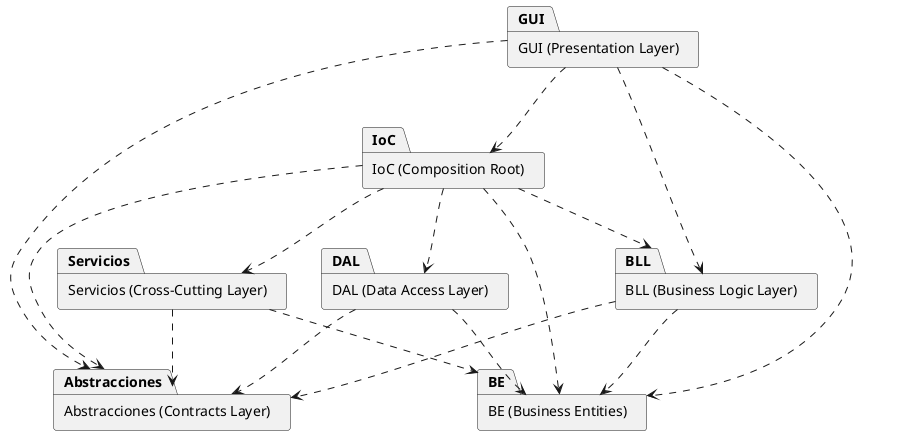

### B. Diagrama de Secuencia - Persistencia Genérica (Mermaid)
Representa el flujo de escritura típico del sistema.
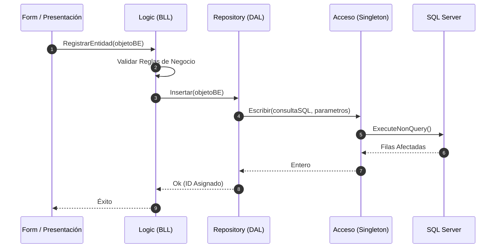

### C. Diagrama de Secuencia - Consulta Genérica (Mermaid)
Representa el flujo de lectura típico del sistema, con mapeo de tabla a entidades BE.
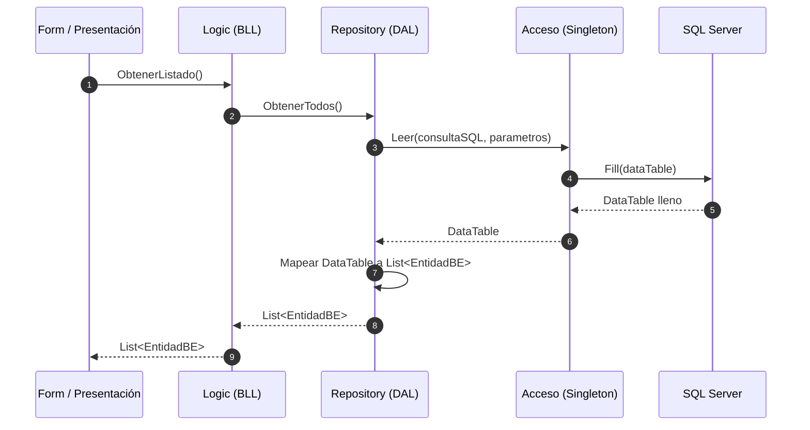

### D. Mapa Tentativo de Navegación (PlantUML)
Representa el flujo de navegación de la interfaz gráfica MDI.
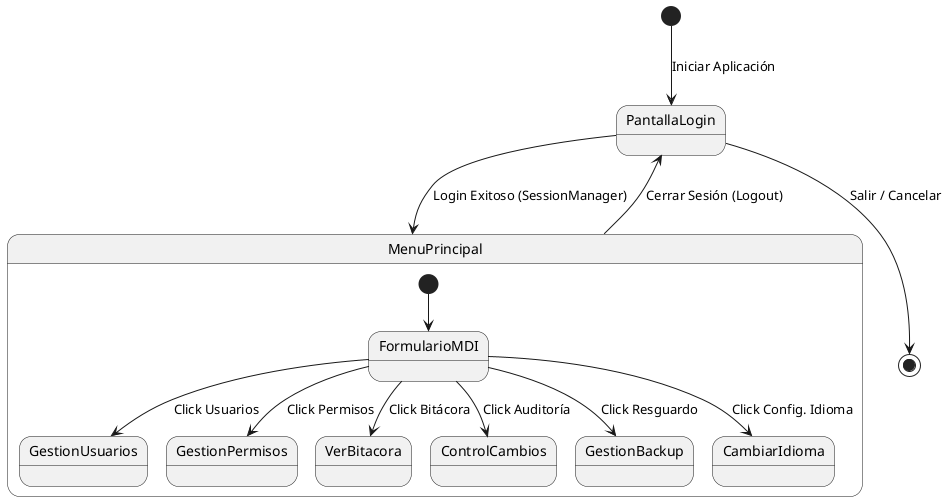

---

## T02. Gestión de Login / Logout y Gestión de Usuarios

### A. Diagrama de Clases del Módulo (PlantUML)
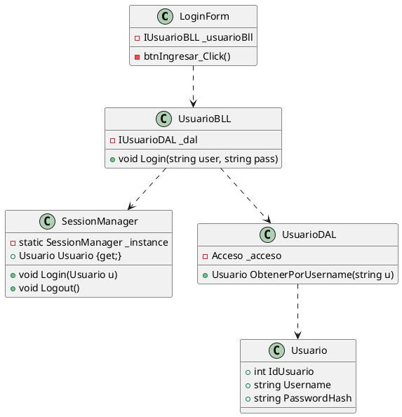

### B. Diagrama de Secuencia - Login (Mermaid)
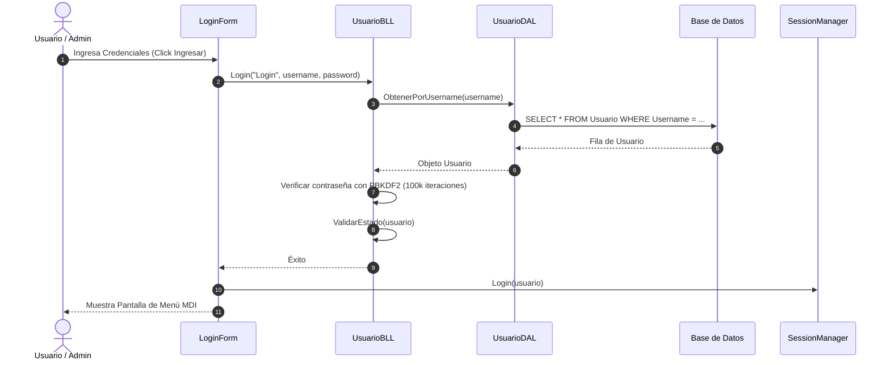

### C. Diagrama de Secuencia - Logout (Mermaid)
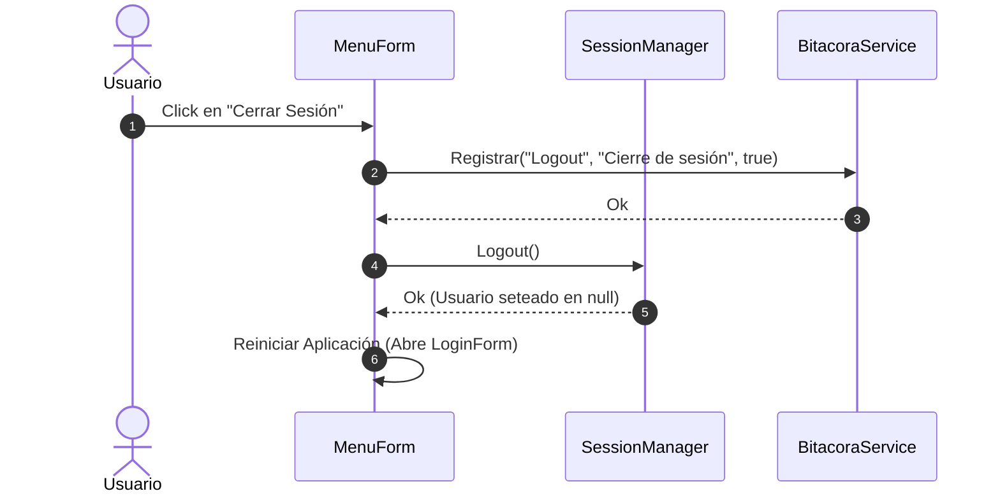

---

## T06a. Gestión de Bitácora

### A. Diagrama de Clases del Módulo (PlantUML)
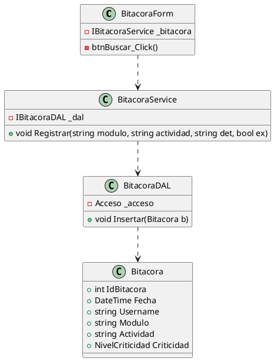

### B. Diagrama de Secuencia - Registro en Bitácora Genérico (Mermaid)
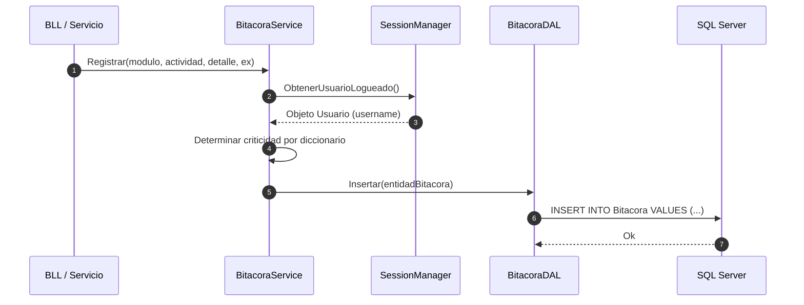

---

## T03. Gestión de Encriptado

### A. Diagrama de Clases del Módulo (PlantUML)
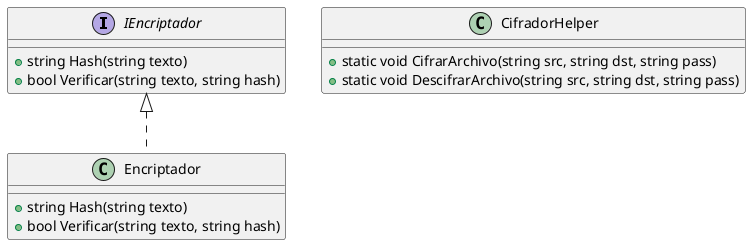

---
---

# PARTE 2: ENTREGA 2 (SPRINT 2)

## T07. Gestión de Dígitos Verificadores (DV)

### A. Diagrama de Clases del Módulo (PlantUML)
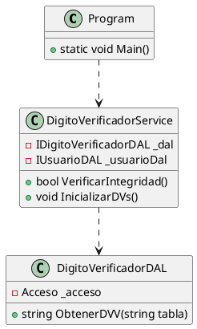

### B. Diagrama de Secuencia - Verificación en Arranque (Mermaid)
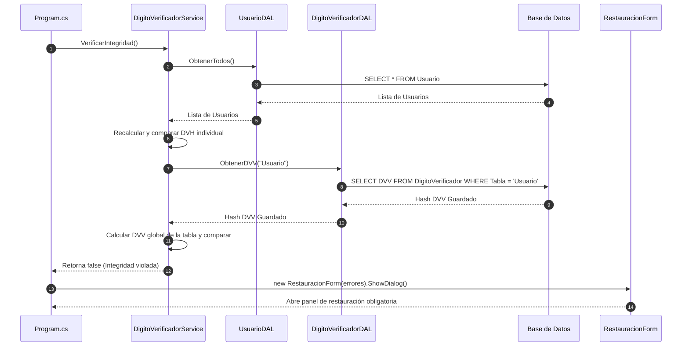

---

## T04. Gestión de Perfiles de Usuario (Patrón Composite)

### A. Diagrama de Clases del Módulo - Patrón Composite (PlantUML)
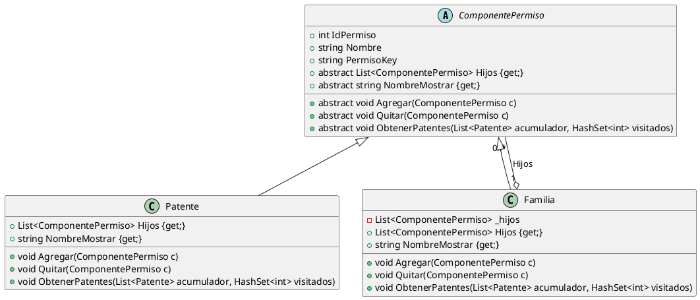

### B. Diagrama de Secuencia - Asignación de Permisos (Mermaid)
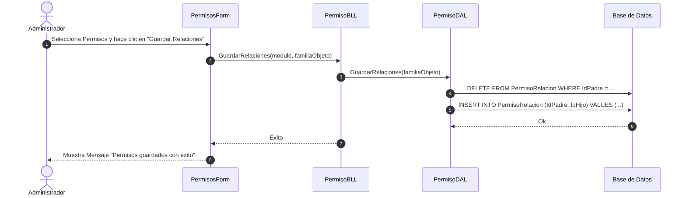

---

## T06b. Control de Cambios

### A. Diagrama de Clases del Módulo (PlantUML)
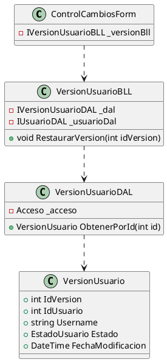

### B. Diagrama de Secuencia - Recomposición / Rollback (Mermaid)
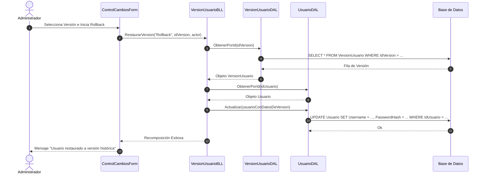

---

## T05. Gestión de Múltiples Idiomas

### A. Diagrama de Clases del Módulo - Patrón Observer (PlantUML)
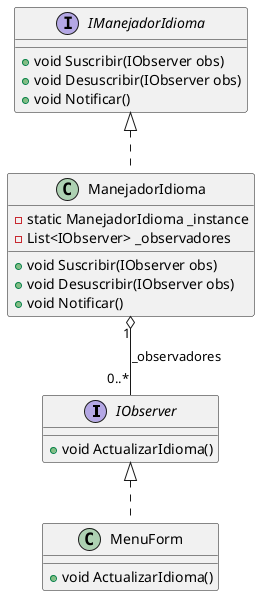

### B. Diagrama de Secuencia - Cambio Dinámico de Idioma (Mermaid)
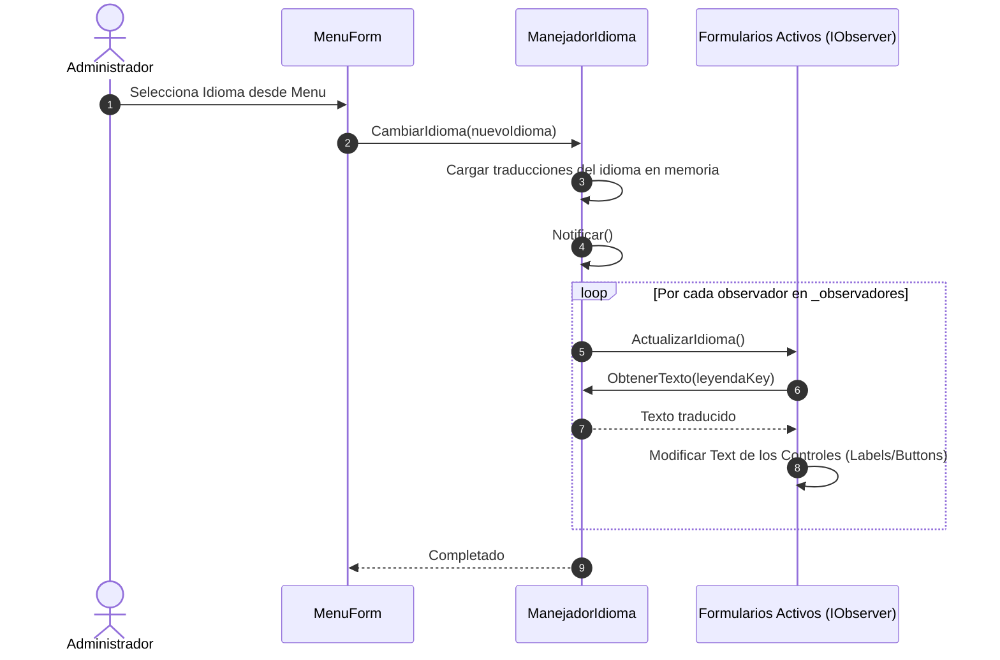

---
---

# PARTE 3: INTEGRACIONES GENERALES (G06 Y G07)

## G06. Diagramas de Clases por Capas (PlantUML)

A continuación, los diagramas parciales separados por capas para cumplir con la especificación de separar infraestructura de negocio.

### Capa 1: Presentación (GUI)
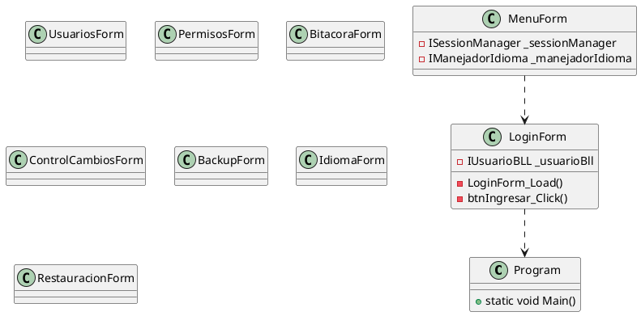

### Capa 2: Lógica de Negocio (BLL)
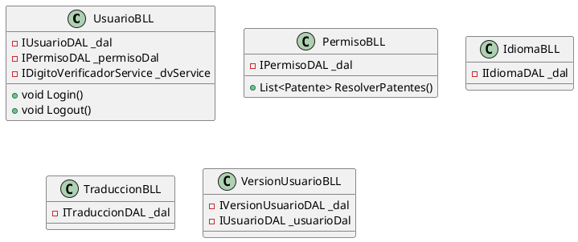

### Capa 3: Servicios (Aspectos Transversales)
```plantuml
@startuml
class SessionManager {
    -static SessionManager _instance
    +Usuario Usuario {get;}
    +void Login(Usuario u)
    +void Logout()
}
class Encriptador {
    +string Hash(string pwd)
}
class CifradorHelper {
    +static void CifrarArchivo()
}
class ManejadorIdioma {
    -static ManejadorIdioma _instance
    -List<IObserver> _observadores
}
class BitacoraService {
    -IBitacoraDAL _dal
}
class DigitoVerificadorService {
    -IDigitoVerificadorDAL _dal
}
class BackupService {
    -IBackupDAL _dal
}
@enduml
```

### Capa 4: Acceso a Datos (DAL)
```plantuml
@startuml
class Acceso {
    -static Acceso _instance
    +DataTable Leer()
    +int Escribir()
}
class UsuarioDAL
class PermisoDAL
class IdiomaDAL
class TraduccionDAL
class BitacoraDAL
class VersionUsuarioDAL
class BackupDAL
class DigitoVerificadorDAL
UsuarioDAL ..> Acceso
PermisoDAL ..> Acceso
@enduml
```

### Capa 5: Abstracciones (Contratos e IoC)
```plantuml
@startuml
interface IUsuarioDAL
interface IPermisoDAL
interface IIdiomaDAL
interface ITraduccionDAL
interface IBitacoraDAL
interface IVersionUsuarioDAL
interface IBackupDAL
interface IDigitoVerificadorDAL
class IoCContainer {
    -static Dictionary<Type, object> _registros
    +static void Registrar()
    +static T Resolve()
}
@enduml
```

### Capa 6: Entidades de Negocio (BE)
```plantuml
@startuml
class Usuario
class VersionUsuario
class Bitacora
class Idioma
class Traduccion
class Componente
abstract class ComponentePermiso
class Patente
class Familia
ComponentePermiso <|-- Patente
ComponentePermiso <|-- Familia
@enduml
```

---

## G07. Modelo de Datos Relacional - DER Pata de Gallo (Mermaid)

```mermaid
erDiagram
    Usuario ||--o{ HistorialUsuario : "tiene historial"
    Usuario ||--o{ Bitacora : "registra acciones"
    Idioma ||--o{ Traduccion : "tiene"
    Componente ||--o{ Traduccion : "traducido en"
    Usuario ||--o{ UsuarioPermiso : "asignado"
    Permiso ||--o{ UsuarioPermiso : "contiene"
    Permiso ||--o{ PermisoRelacion : "es padre de"
    Permiso ||--o{ PermisoRelacion : "es hijo de"

    Usuario {
        int IdUsuario PK
        string Username
        string PasswordHash
        int Estado
        datetime FechaAlta
        datetime UltimoLogin
        string DVH
    }

    HistorialUsuario {
        int IdVersion PK
        int IdUsuario FK
        string Username
        int Estado
        datetime FechaModificacion
        string ModificadoPor
        string DetalleCambios
    }

    Bitacora {
        int IdBitacora PK
        datetime Fecha
        int IdUsuario FK
        string Username
        string Modulo
        string Actividad
        int Criticidad
        bool Exitoso
        string Detalle
        string Error
    }

    Idioma {
        int IdIdioma PK
        string Nombre
        string Codigo
        bool Default
    }

    Componente {
        int IdComponente PK
        string Nombre
    }

    Traduccion {
        int IdIdioma PK, FK
        int IdComponente PK, FK
        string Texto
    }

    Permiso {
        int IdPermiso PK
        string Nombre
        string PermisoKey
        bool EsFamilia
    }

    PermisoRelacion {
        int IdPermisoPadre PK, FK
        int IdPermisoHijo PK, FK
    }

    UsuarioPermiso {
        int IdUsuario PK, FK
        int IdPermiso PK, FK
    }

    DigitoVerificador {
        string Tabla PK
        string DVV
    }
```
