# Código de Diagramas UML y DER (Mermaid)

Este documento contiene los códigos fuente de todos los diagramas del sistema **Stach**, escritos **100% en formato Mermaid** con la incorporación explícita de la capa de **Abstracciones** (contratos/interfaces e IoCContainer) para reflejar con precisión el desacoplamiento de la arquitectura de 6 capas y garantizar total compatibilidad con [Mermaid Live Editor](https://mermaid.live).

---

# PARTE 1: ENTREGA 1 (SPRINT 1)

## T01. Arquitectura Base

### A. Diagrama de Componentes de la Arquitectura (Mermaid Flowchart)
Representa la relación de dependencias y el flujo transversal de llamadas entre las 6 capas con estilo de colores y bordes.
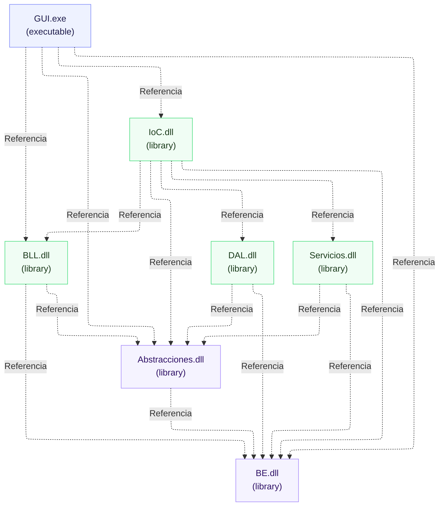

### B. Diagrama de Secuencia - Persistencia Genérica (Mermaid)
Muestra cómo las llamadas fluyen a través de las abstracciones y el contenedor IoC para desacoplar la persistencia.
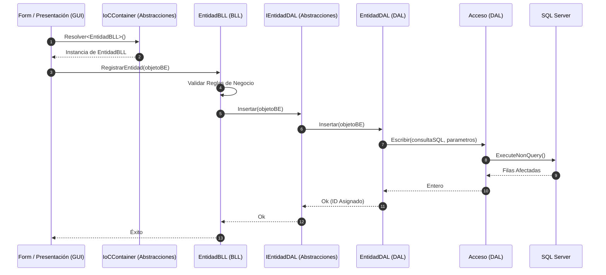

### C. Diagrama de Secuencia - Consulta Genérica (Mermaid)
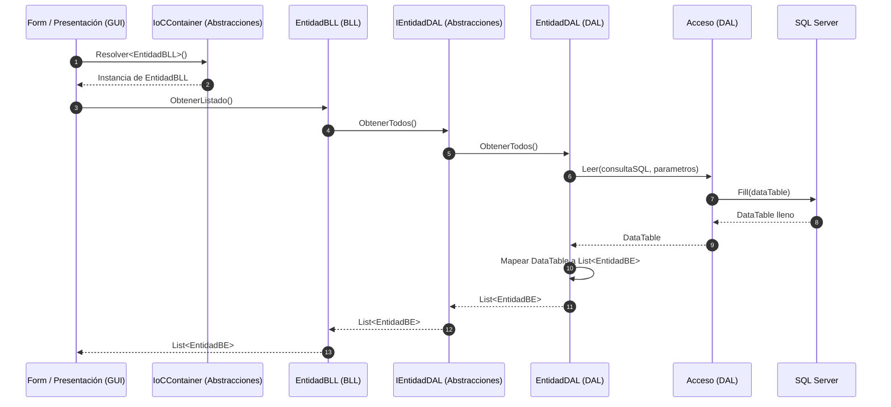

### D. Mapa Tentativo de Navegación (Mermaid State)
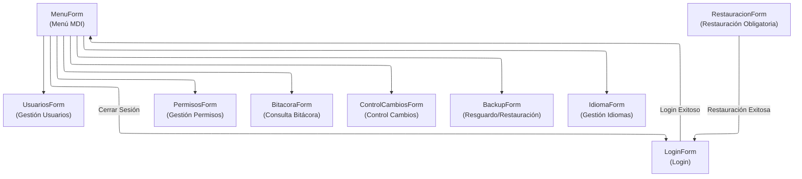

---

## T02. Gestión de Login / Logout y Gestión de Usuarios

### A. Diagrama de Clases del Módulo (Mermaid Class)
Muestra la dependencia de LoginForm y BLL hacia los contratos (Abstracciones), logrando un desacoplamiento completo de la capa de datos.
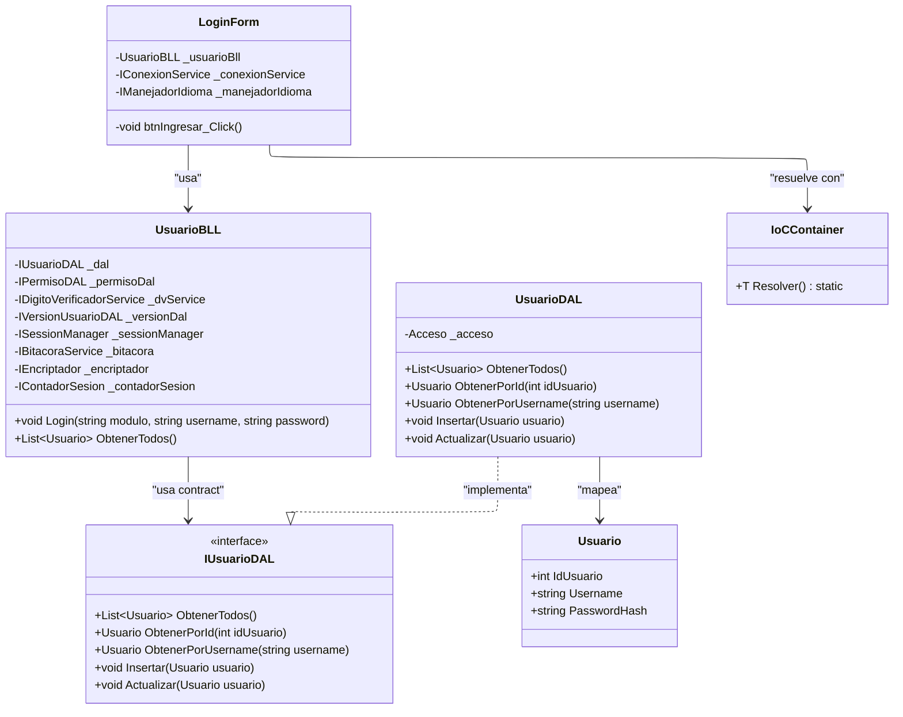

### B. Diagrama de Secuencia - Login (Mermaid)
Ilustra la resolución dinámica de dependencias mediante el contenedor de IoC y llamadas desacopladas vía interfaces.
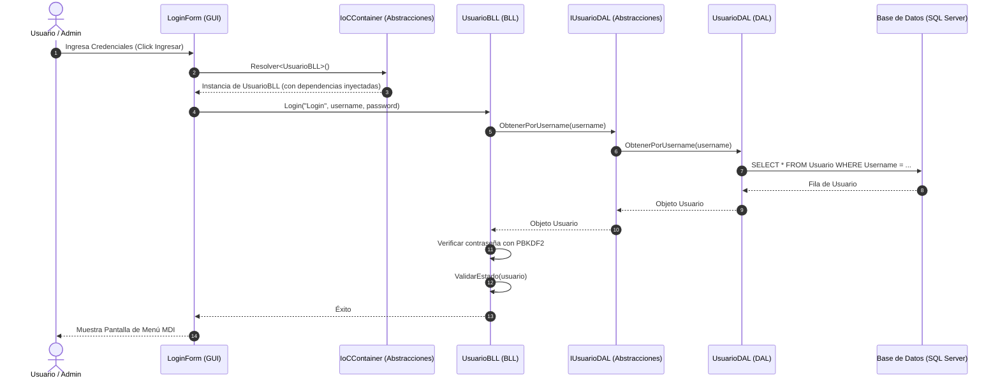

### C. Diagrama de Secuencia - Logout (Mermaid)
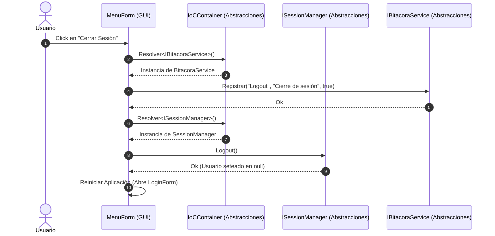

---

## T06a. Gestión de Bitácora

### A. Diagrama de Clases del Módulo (Mermaid Class)
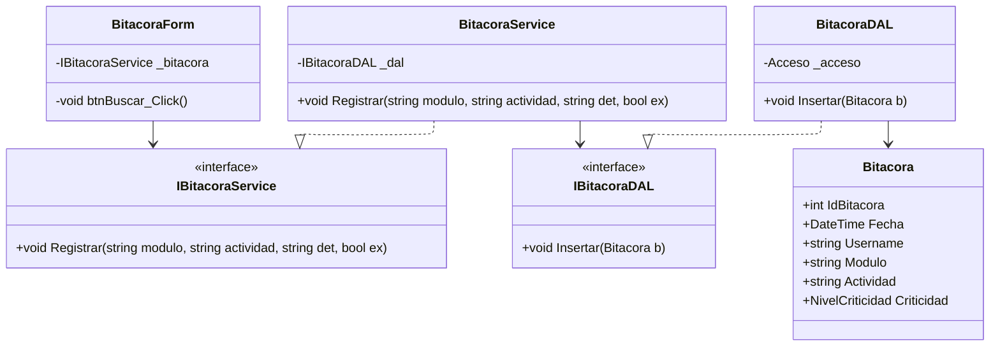

### B. Diagrama de Secuencia - Registro en Bitácora Genérico (Mermaid)
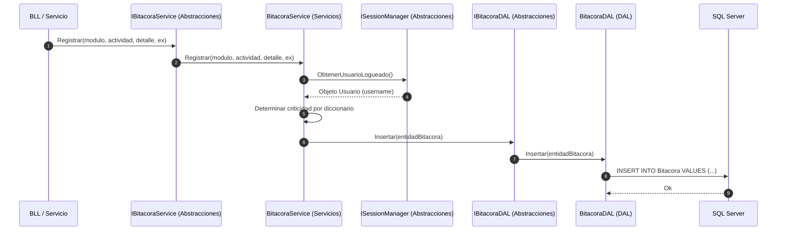

---

## T03. Gestión de Encriptado

### A. Diagrama de Clases del Módulo (Mermaid Class)
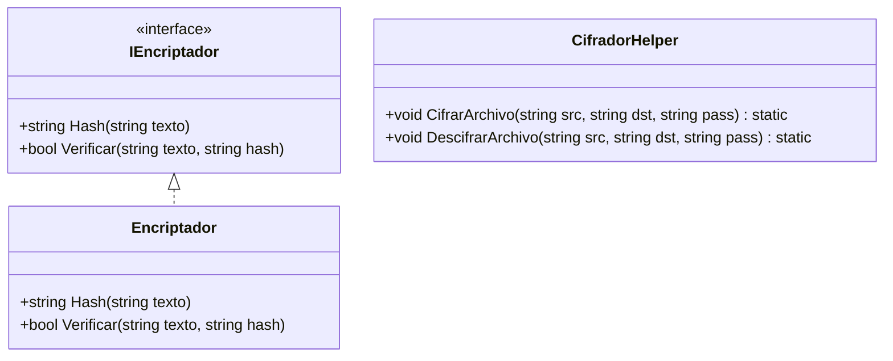

---
---

# PARTE 2: ENTREGA 2 (SPRINT 2)

## T07. Gestión de Dígitos Verificadores (DV)

### A. Diagrama de Clases del Módulo (Mermaid Class)
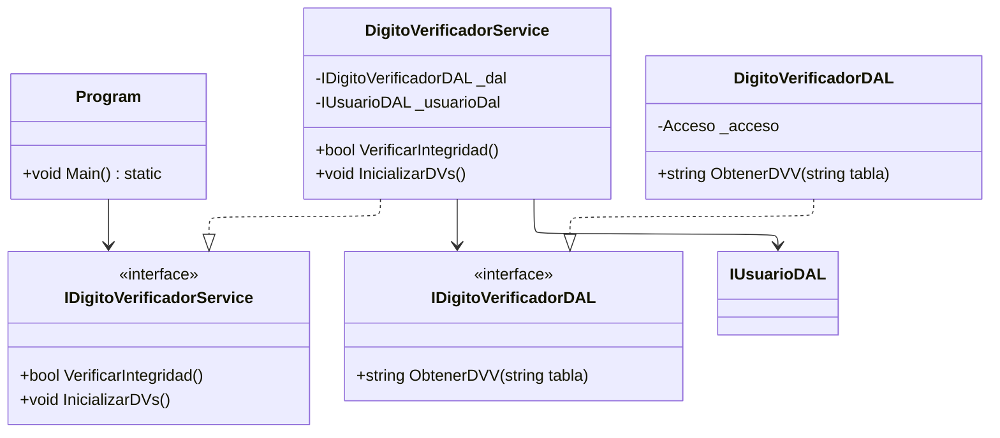

### B. Diagrama de Secuencia - Verificación en Arranque (Mermaid)
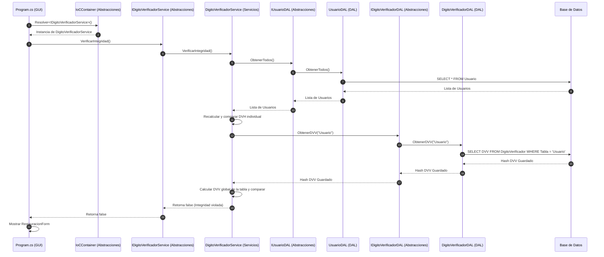

---

## T04. Gestión de Perfiles de Usuario (Patrón Composite)

### A. Diagrama de Clases del Módulo - Patrón Composite (Mermaid Class)
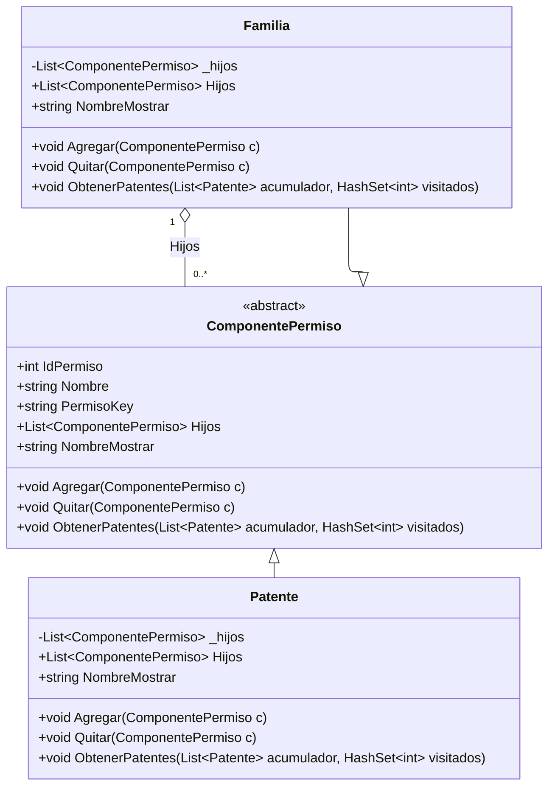

### B. Diagrama de Secuencia - Asignación de Permisos (Mermaid)
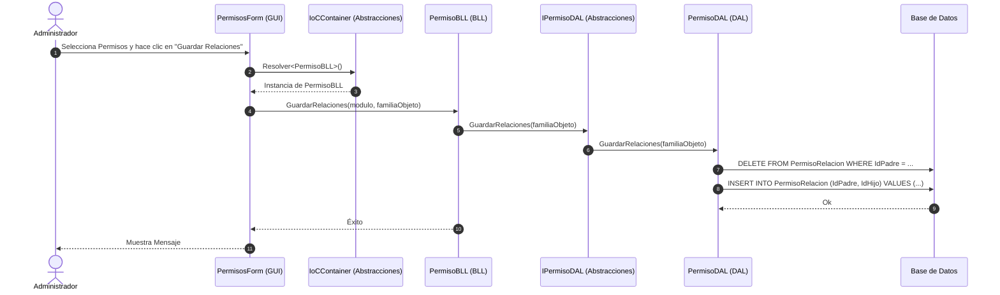

---

## T06b. Control de Cambios

### A. Diagrama de Clases del Módulo (Mermaid Class)
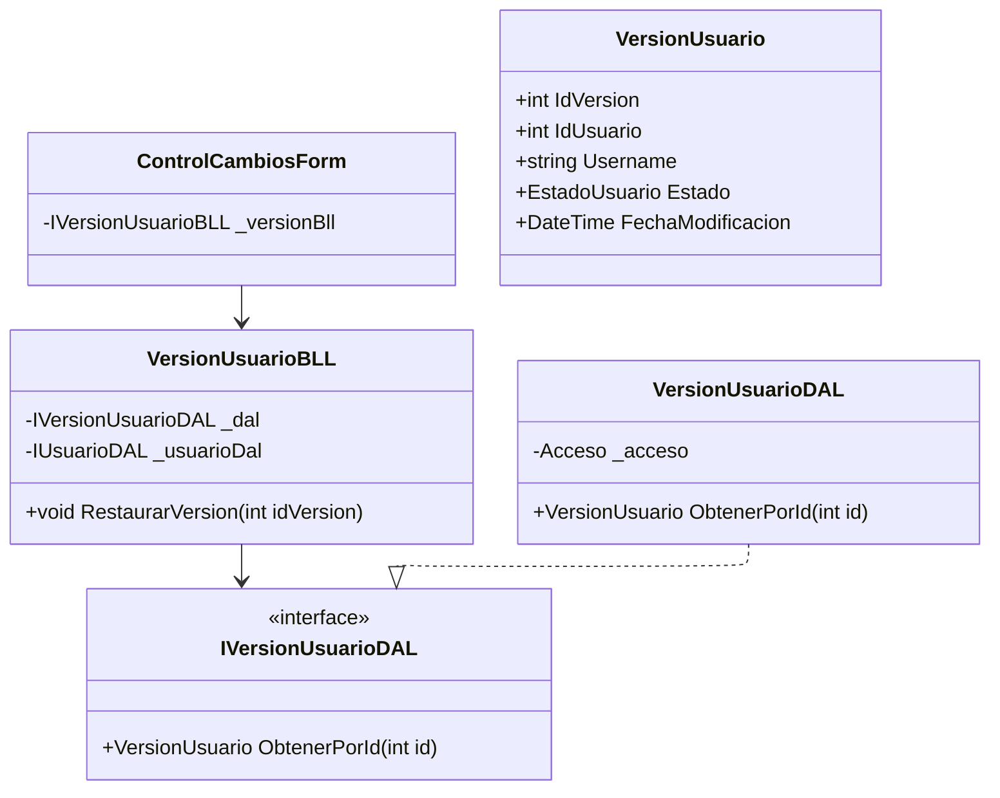

### B. Diagrama de Secuencia - Recomposición / Rollback (Mermaid)
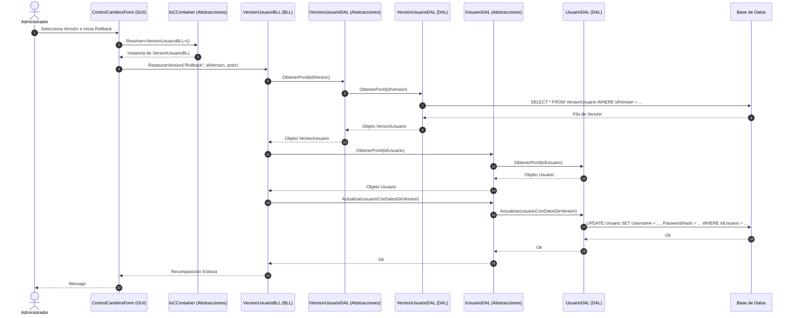

---

## T05. Gestión de Múltiples Idiomas

### A. Diagrama de Clases del Módulo - Patrón Observer (Mermaid Class)
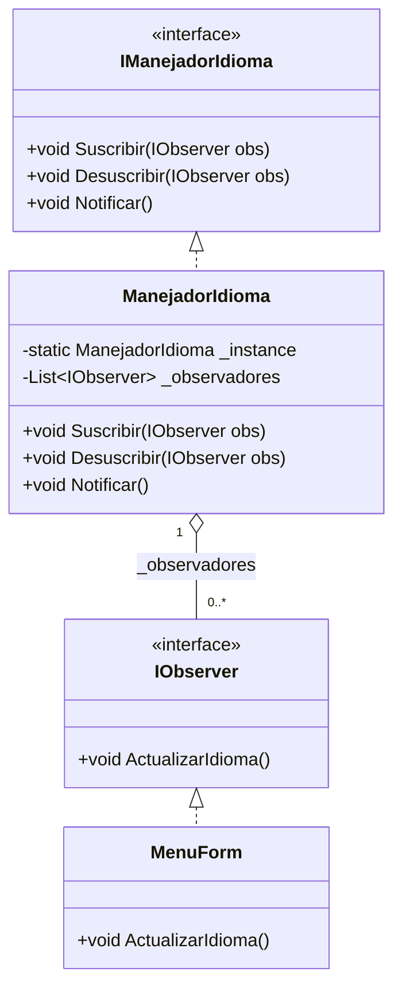

### B. Diagrama de Secuencia - Cambio Dinámico de Idioma (Mermaid)
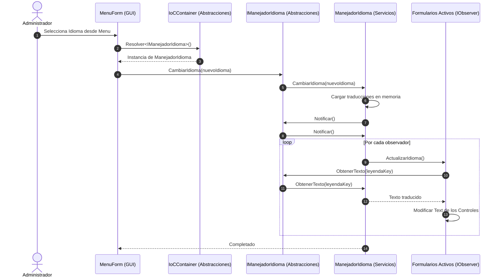

---
---

# PARTE 3: INTEGRACIONES GENERALES (G06 Y G07)

## G06. Diagramas de Clases por Capas (Mermaid Class)

A continuación, los diagramas parciales separados por capas para cumplir con la especificación de separar infraestructura de negocio.

### Capa 1: Presentación (GUI)
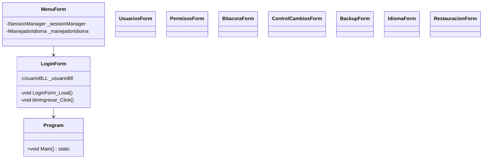

### Capa 2: Lógica de Negocio (BLL)
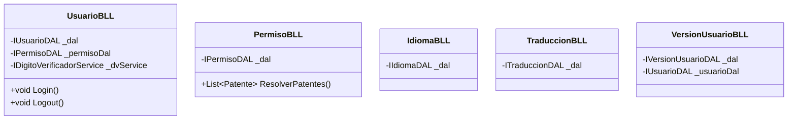

### Capa 3: Servicios (Aspectos Transversales)
```mermaid
---
config:
  layout: elk
---
classDiagram
    class SessionManager {
        -static SessionManager _instance
        +Usuario Usuario
        +void Login(Usuario u)
        +void Logout()
    }
    class Encriptador {
        +string Hash(string pwd) static
    }
    class CifradorHelper {
        +void CifrarArchivo() static
    }
    class ManejadorIdioma {
        -static ManejadorIdioma _instance
        -List~IObserver~ _observadores
    }
    class BitacoraService {
        -IBitacoraDAL _dal
    }
    class DigitoVerificadorService {
        -IDigitoVerificadorDAL _dal
    }
    class BackupService {
        -IBackupDAL _dal
    }
```

### Capa 4: Acceso a Datos (DAL)
```mermaid
---
config:
  layout: elk
---
classDiagram
    class Acceso {
        -static Acceso _instance
        +DataTable Leer()
        +int Escribir()
    }
    class UsuarioDAL
    class PermisoDAL
    class IdiomaDAL
    class TraduccionDAL
    class BitacoraDAL
    class VersionUsuarioDAL
    class BackupDAL
    class DigitoVerificadorDAL
    UsuarioDAL --> Acceso
    PermisoDAL --> Acceso
```

### Capa 5: Abstracciones (Contratos e IoC)
```mermaid
---
config:
  layout: elk
---
classDiagram
    class IUsuarioDAL { <<interface>> }
    class IPermisoDAL { <<interface>> }
    class IIdiomaDAL { <<interface>> }
    class ITraduccionDAL { <<interface>> }
    class IBitacoraDAL { <<interface>> }
    class IVersionUsuarioDAL { <<interface>> }
    class IBackupDAL { <<interface>> }
    class IDigitoVerificadorDAL { <<interface>> }
    class IoCContainer {
        -static Dictionary~Type-object~ _registros
        +void Registrar() static
        +T Resolve() static
    }
```

### Capa 6: Entidades de Negocio (BE) y Composite Pattern (Negocio)
```mermaid
---
config:
  layout: elk
---
classDiagram
    class Usuario {
        +int IdUsuario
        +string Username
        +string PasswordHash
        +EstadoUsuario Estado
        +DateTime FechaAlta
        +DateTime UltimoLogin
        +string DVH
        +List~ComponentePermiso~ Permisos
    }

    class ComponentePermiso {
        +int IdPermiso
        +string Nombre
        +string PermisoKey
        +List~ComponentePermiso~ Hijos
        +string NombreMostrar
        +void Agregar(ComponentePermiso comp)
        +void Quitar(ComponentePermiso comp)
    }

    class Patente {
        +List~ComponentePermiso~ Hijos
        +void Agregar(ComponentePermiso comp)
        +void Quitar(ComponentePermiso comp)
    }

    class Familia {
        -List~ComponentePermiso~ _hijos
        +List~ComponentePermiso~ Hijos
        +void Agregar(ComponentePermiso comp)
        +void Quitar(ComponentePermiso comp)
    }

    class VersionUsuario {
        +int IdVersion
        +int IdUsuario
        +string Username
        +EstadoUsuario Estado
        +DateTime FechaModificacion
        +string ModificadoPor
        +string DetalleCambios
    }

    class Bitacora {
        +int IdBitacora
        +DateTime Fecha
        +int IdUsuario
        +string Username
        +string Modulo
        +string Actividad
        +NivelCriticidad Criticidad
        +bool Exitoso
        +string Detalle
        +string Error
    }

    class Idioma {
        +int IdIdioma
        +string Nombre
        +string Codigo
        +bool Default
    }

    class Traduccion {
        +int IdIdioma
        +int IdComponente
        +string Texto
    }

    ComponentePermiso <|-- Patente
    ComponentePermiso <|-- Familia
    Usuario "1" o-- "0..*" ComponentePermiso : Permisos
    Familia "1" o-- "0..*" ComponentePermiso : Hijos
    Usuario "1" *-- "0..*" VersionUsuario : Historial
    Idioma "1" *-- "0..*" Traduccion : Traducciones
```

---

## G07. Modelo de Datos Relacional - DER Pata de Gallo (Mermaid)

```mermaid
erDiagram
    Usuario ||--o{ HistorialUsuario : "tiene historial"
    Usuario ||--o{ Bitacora : "registra acciones"
    Idioma ||--o{ Traduccion : "tiene"
    Componente ||--o{ Traduccion : "traducido en"
    Usuario ||--o{ UsuarioPermiso : "asignado"
    Permiso ||--o{ UsuarioPermiso : "contiene"
    Permiso ||--o{ PermisoRelacion : "es padre de"
    Permiso ||--o{ PermisoRelacion : "es hijo de"

    Usuario {
        int IdUsuario PK
        string Username
        string PasswordHash
        int Estado
        datetime FechaAlta
        datetime UltimoLogin
        string DVH
    }

    HistorialUsuario {
        int IdVersion PK
        int IdUsuario FK
        string Username
        int Estado
        datetime FechaModificacion
        string ModificadoPor
        string DetalleCambios
    }

    Bitacora {
        int IdBitacora PK
        datetime Fecha
        int IdUsuario FK
        string Username
        string Modulo
        string Actividad
        int Criticidad
        bool Exitoso
        string Detalle
        string Error
    }

    Idioma {
        int IdIdioma PK
        string Nombre
        string Codigo
        bool Default
    }

    Componente {
        int IdComponente PK
        string Nombre
    }

    Traduccion {
        int IdIdioma PK, FK
        int IdComponente PK, FK
        string Texto
    }

    Permiso {
        int IdPermiso PK
        string Nombre
        string PermisoKey
        bool EsFamilia
    }

    PermisoRelacion {
        int IdPermisoPadre PK, FK
        int IdPermisoHijo PK, FK
    }

    UsuarioPermiso {
        int IdUsuario PK, FK
        int IdPermiso PK, FK
    }

    DigitoVerificador {
        string Tabla PK
        string DVV
    }
```
