# Código de Diagramas UML y DER (PlantUML / Mermaid)

Este documento contiene los códigos fuente de todos los diagramas del sistema **Stach** en su arquitectura final de 6 capas, alineados con los requerimientos de la **Entrega 1 y 2 del plan de Excel**.

---

## 1. Diagramas de Clases por Capas (Requerimiento G06 - PlantUML)

Para cumplir con el requerimiento **G06 del Excel** (*"Deberá realizarse un diagrama de clases por cada capa de la arquitectura. Deberán separarse los aspectos técnicos y el negocio"*), a continuación se presentan los códigos PlantUML para cada una de las capas.

### A. Capa de Entidades de Negocio (BE) y Estructura del Patrón Composite (Negocio)
Este diagrama ilustra las entidades de datos y la implementación del patrón Composite para perfiles de usuario.
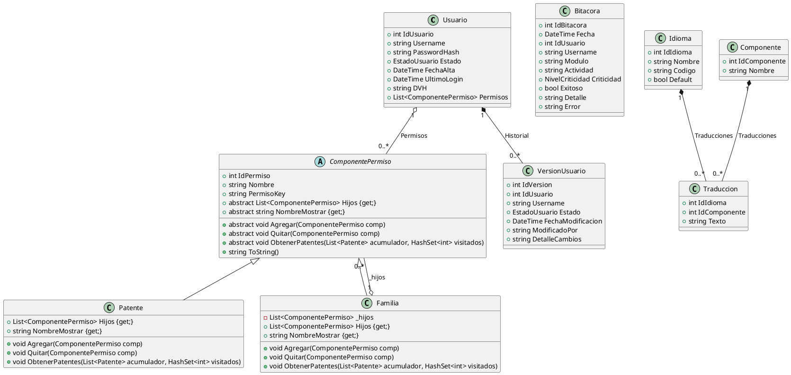

### B. Capa de Presentación (GUI)
Esta capa es responsable de la interfaz gráfica y la interacción directa con el usuario final. Está completamente desacoplada de Servicios y de la DAL mediante contratos en Abstracciones.
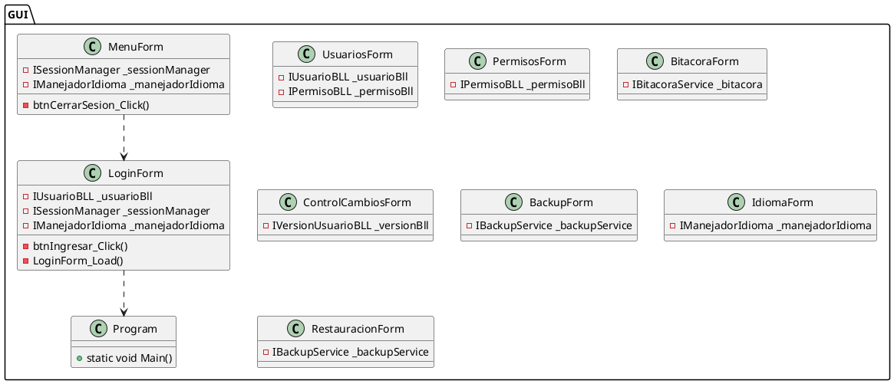

### C. Capa de Lógica de Negocio (BLL)
Esta capa concentra las reglas del negocio. Interactúa únicamente con interfaces de la capa de Abstracciones y con las entidades BE.
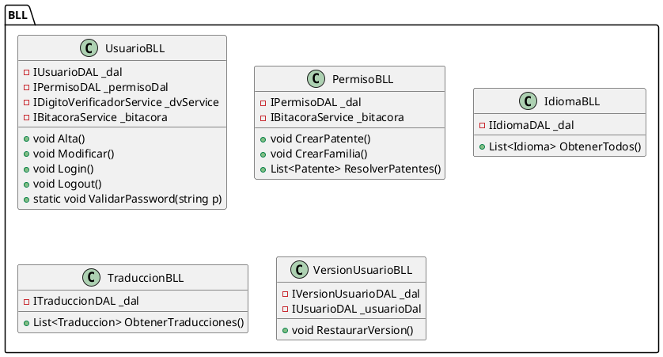

### D. Capa de Servicios (Aspectos Técnicos / Transversales)
Esta capa centraliza funcionalidades de seguridad, encriptación, bitácora e integridad de datos.
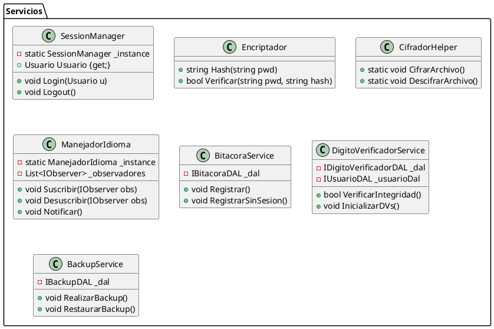

### E. Capa de Acceso a Datos (DAL)
Esta capa es responsable de la persistencia directa en SQL Server, interactuando con la clase genérica `Acceso`.
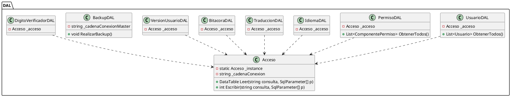

### F. Capa de Abstracciones (Contratos e Inversión de Control)
Contiene las interfaces que desacoplan la solución y la clase `IoCContainer` para la Composición de dependencias.
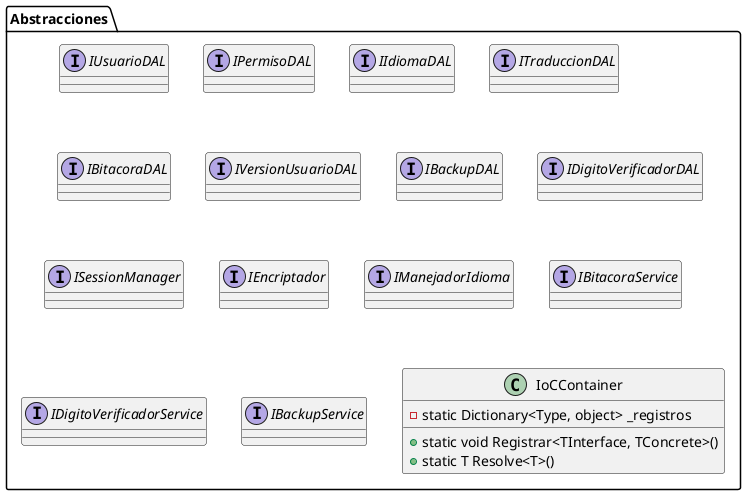

---

## 2. Diagramas de Clases por Módulos (Requerimientos Técnicos T02 - T08 - PlantUML)

### A. Gestión de Perfiles de Usuario (T04 - Patrón Composite)
*(Modela estrictamente el patrón Composite en la capa de negocio sin dependencias técnicas)*
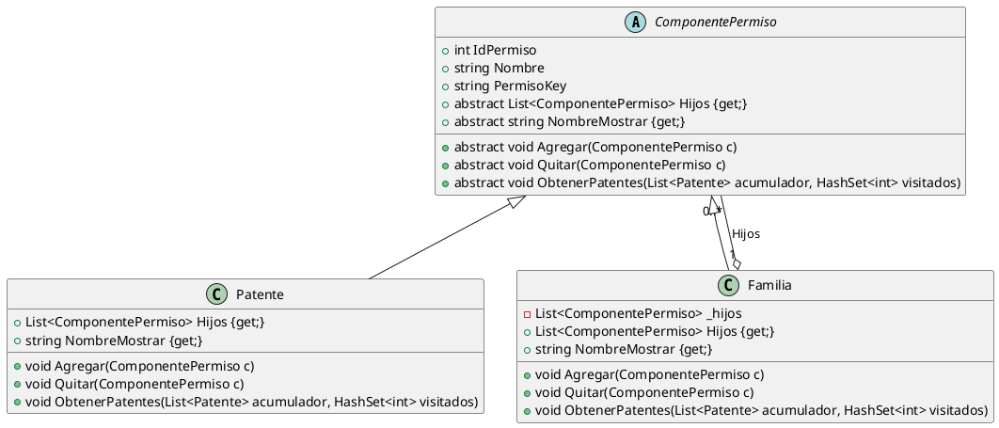

### B. Gestión de Múltiples Idiomas (T05 - Patrón Observer)
*(Muestra el desacoplamiento entre el publicador y los suscriptores de traducciones)*
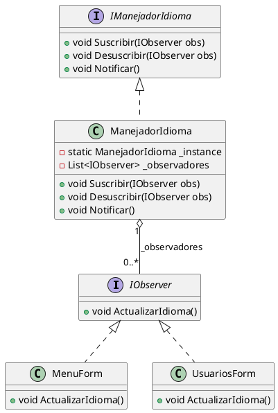

---

## 3. Diagramas de Secuencia por Procesos Clave (Formatos Mermaid)

### A. Inicio de Sesión (T02 - Login)
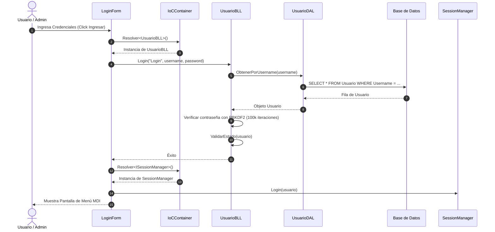

### B. Generación y Cifrado de Backup (T07 - Backup)
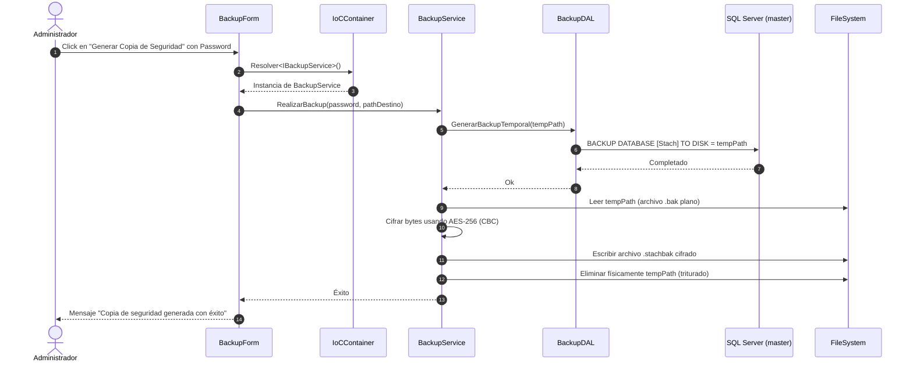

### C. Reversión de Cambios de Usuario (T06b - Rollback)
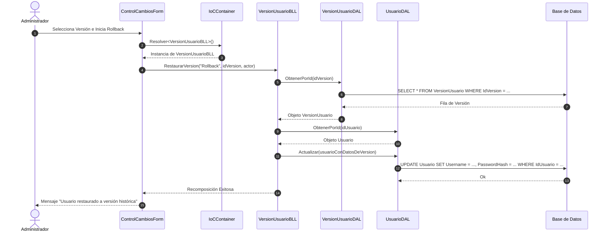

### D. Control de Integridad en Arranque (T08 - Dígitos Verificadores)
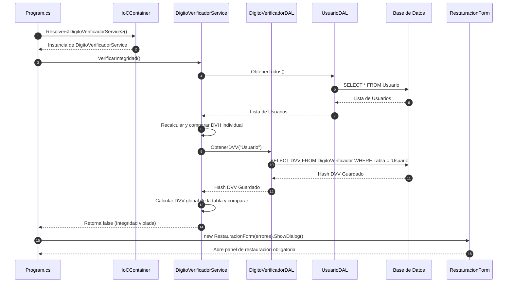

---

## 4. Modelo de Datos Relacional - DER Pata de Gallo (Requerimiento G07 - Mermaid)

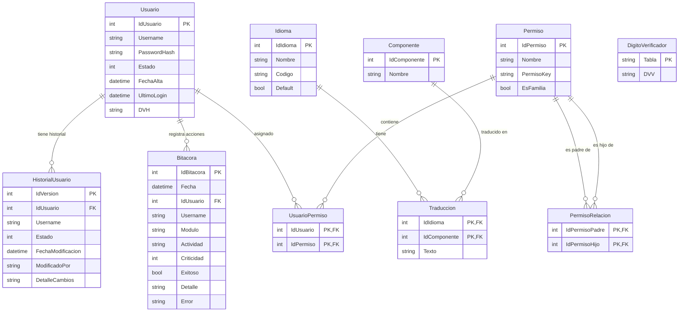
